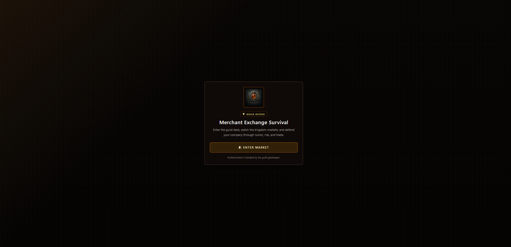
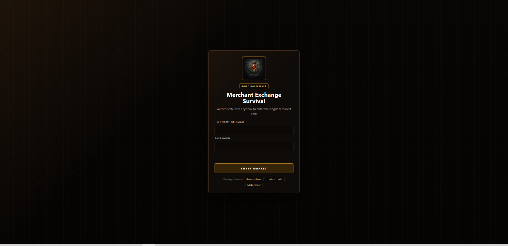
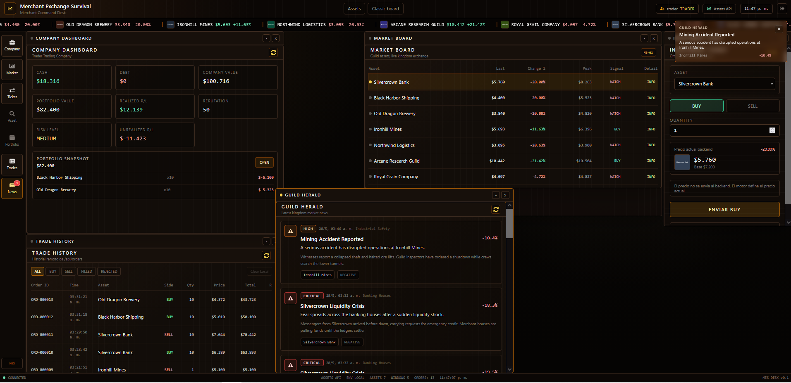
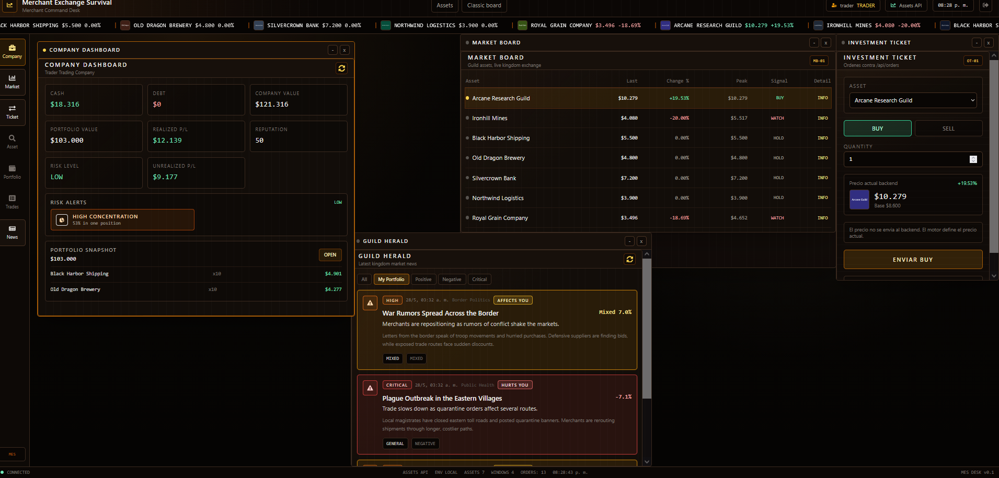
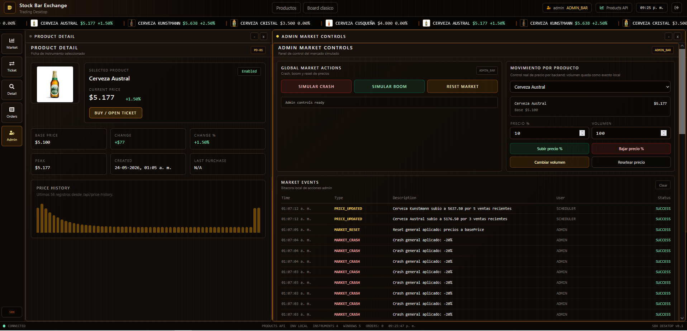

# Merchant Exchange Survival

**Merchant Exchange Survival** is a full-stack economic survival game built as a desktop-style trading platform.

The player controls a merchant company in a medieval/fantasy market. The goal is to survive market shocks, grow the company, manage risk, and profit from fictional assets through buying, selling, portfolio management, world news, and game master events.

## Current Version

The project now includes the complete playable foundation:

- Phase 1: Merchant Exchange Survival branding and fictional fantasy assets.
- Phase 2: Player company, cash, holdings, portfolio, and company dashboard.
- Phase 3: Real BUY/SELL orders, MarketOrder history, realized P/L, and portfolio updates.
- Phase 4: Guild Herald world news, price impact events, risk system, and notifications.
- Phase 4.2: Better personal news semantics such as `BENEFITS YOU`, `HURTS YOU`, `BOUGHT THE DIP`, and `BOUGHT AFTER RALLY`.
- UX polish: portfolio holdings can select the global asset for fast selling through Investment Ticket.
- Auth polish: custom frontend login screen and custom Keycloak login theme using the project logo.

## Screenshots

### Login




### Trading News




### Admin Market Controls



## Technical Documentation

- [Resumen tecnico integral del proyecto](docs/RESUMEN-TECNICO-TRADING-BAR-EXCHANGE.md)
- [REQ-001 Trading Desktop](docs/REQ-001-trading-desktop.md)
- [REQ-007 Keycloak](docs/REQ-007-keycloak.md)
- [REQ-008 Docker Compose](docs/REQ-008-docker-compose.md)
- [Codex Project Memory](docs/CODEX_PROJECT_MEMORY.md)

## Gameplay Concept

Merchant Exchange Survival turns a trading terminal into a strategy/survival game.

Instead of trading real stocks, the player trades fictional medieval/fantasy assets:

- Ironhill Mines
- Black Harbor Shipping
- Silvercrown Bank
- Northwind Logistics
- Royal Grain Company
- Arcane Research Guild
- Old Dragon Brewery

Core gameplay loop:

```txt
Select an asset
    -> Buy or sell through Investment Ticket
    -> World news changes market conditions
    -> Prices move and PriceHistory is saved
    -> Portfolio value and P/L change
    -> Company value and risk level update
    -> Player reacts: sell, hold, buy more, or survive
```

## Main Features

### Trading Desktop

The frontend behaves like a small game operating system. Apps open inside movable, focusable, minimizable desktop windows.

Current apps:

| App | Description |
| --- | --- |
| Market Board | Shows fictional assets, prices, trends, and quick actions |
| Asset Detail | Shows the selected asset and price history |
| Investment Ticket | Sends real BUY and SELL orders |
| Portfolio | Shows holdings, average price, market value, and unrealized P/L |
| Company Dashboard | Shows cash, company value, portfolio value, P/L, risk, and portfolio snapshot |
| Trade History | Shows executed BUY and SELL orders |
| Guild Herald | Shows immersive world news that move the market |
| Game Master Controls | Lets admin users trigger world events and market actions |

The selected asset is global. Selecting an asset from Market Board, Portfolio, or Company Dashboard updates:

- Investment Ticket
- Asset Detail
- Admin controls where relevant

This makes portfolio-driven selling fast: click a holding, then use Investment Ticket.

### Player Company Economy

Each authenticated user has a player company.

The company tracks:

- Cash
- Debt
- Company value
- Portfolio value
- Realized P/L
- Unrealized P/L
- Reputation
- Risk level

BUY flow:

```txt
Validate asset and quantity
Validate enough cash
Decrease cash
Create or update Holding
Recalculate weighted average price
Create MarketOrder
Register MarketEvent ORDER_BUY_FILLED
Refresh company value
```

SELL flow:

```txt
Validate asset and quantity
Validate holding exists
Validate enough quantity
Increase cash
Reduce or remove Holding
Calculate realized P/L
Accumulate PlayerCompany.realizedPnl
Create MarketOrder
Register MarketEvent ORDER_SELL_FILLED
Refresh company value
```

### Portfolio System

Portfolio holdings include:

- Asset id and name
- Quantity
- Average price
- Current price
- Market value
- Unrealized P/L
- Unrealized P/L %
- Holding createdAt/updatedAt timestamps

Positions with zero quantity are not shown.

Portfolio rows and Company Dashboard snapshot rows are clickable. They select the asset globally, so Investment Ticket and Asset Detail update automatically.

### Orders And Trade History

Main trading endpoint:

```http
POST /api/orders
GET /api/orders
```

Order request:

```json
{
  "assetId": 1,
  "side": "BUY",
  "quantity": 5
}
```

Order response:

```json
{
  "id": 10,
  "assetId": 1,
  "assetName": "Ironhill Mines",
  "side": "SELL",
  "quantity": 2,
  "executedPrice": 5228,
  "totalAmount": 10456,
  "realizedPnl": 256,
  "status": "FILLED",
  "companyCash": 74456,
  "timestamp": "2026-05-28T10:20:00"
}
```

Validation:

- BUY rejects insufficient cash with conflict.
- SELL rejects missing holdings.
- SELL rejects selling more than owned.
- Orders execute at current market price.

Legacy sales endpoints remain available for compatibility, but the main gameplay flow uses MarketOrder:

```http
POST /api/sales
GET /api/sales
```

### Guild Herald And World News

World events are exposed as immersive news, not technical logs.

The visible player layer is **Guild Herald**.

Supported event types:

```txt
ROYAL_CONTRACT
MINING_ACCIDENT
PORT_BLOCKADE
BANKING_CRISIS
HARVEST_BOOM
PLAGUE_OUTBREAK
WAR_RUMORS
MAGIC_DISCOVERY
```

News flow:

```txt
Admin or scheduler triggers world event
    -> A WorldNewsItem is created
    -> Affected asset or sector prices change
    -> PriceHistory is saved
    -> Market Board reflects new prices
    -> Portfolio unrealized P/L changes
    -> Company risk updates on company read
    -> Toast notification appears
```

Guild Herald filters:

- All
- My Portfolio
- Positive
- Negative
- Critical

Personal news semantics:

| Direction and timing | Badge | Hint |
| --- | --- | --- |
| Positive while holding | `BENEFITS YOU` | Your holdings may benefit from this event. |
| Negative while holding | `HURTS YOU` | Your holdings may be hit by this event. |
| Mixed while holding | `AFFECTS YOU` | Your holdings are exposed to market volatility. |
| Neutral while holding | `WATCH` | This news is related to your holdings. |
| Positive before entry | `BOUGHT AFTER RALLY` | You entered this position after the price move. |
| Negative before entry | `BOUGHT THE DIP` | You entered this position after the initial drop. |
| Mixed before entry | `POST-EVENT ENTRY` | You opened this position after this news was priced in. |
| Neutral before entry | `RELATED POSITION` | This older news is related to your current holdings. |

Mixed events are displayed as market volatility, not as a simple up/down move.

### Risk System

Company risk is recalculated from financial state.

Inputs include:

- Cash
- Debt
- Company value
- Portfolio value
- Cost basis
- Unrealized P/L
- Portfolio exposure

Risk levels:

- LOW
- MEDIUM
- HIGH
- CRITICAL

Company Dashboard also shows visual risk alerts:

- Low cash
- High concentration
- Negative unrealized P/L
- Critical risk

### Game Master Controls

Admin users can trigger:

- Random world event
- Specific world events
- Market boom
- Market crash
- Market reset
- Product price up/down/reset

After admin events, the frontend refreshes:

- Assets
- News
- Company
- Portfolio

## Authentication

Authentication uses Keycloak through the existing OIDC flow. The frontend does not manually call token endpoints for normal login.

Visible auth experience:

- Custom frontend pre-login screen with Merchant Exchange Survival branding.
- Custom Keycloak login theme mounted from Docker.
- Same standard Keycloak username/password form.
- Same realm, clients, roles, and demo users.

Keycloak theme location:

```txt
docker/keycloak/themes/merchant-exchange/login
```

The theme uses:

```txt
docker/keycloak/themes/merchant-exchange/login/resources/img/merchant-logo.png
```

Frontend login screen uses:

```txt
stock-bar-frontend/public/branding/merchant-logo.png
```

Roles:

| Role | Description |
| --- | --- |
| `VIEWER` | Read-only market user |
| `TRADER` | Can trade and view portfolio/orders |
| `ADMIN_BAR` | Game Master / admin role |

Role access:

| Role | Market | Detail | Ticket | Portfolio | Company | Herald | Orders | Game Master |
| --- | ---: | ---: | ---: | ---: | ---: | ---: | ---: | ---: |
| `VIEWER` | Yes | Yes | No | No | No | Yes | No | No |
| `TRADER` | Yes | Yes | Yes | Yes | Yes | Yes | Yes | No |
| `ADMIN_BAR` | Yes | Yes | Yes | Yes | Yes | Yes | Yes | Yes |

Demo users:

| User | Password | Role |
| --- | --- | --- |
| `viewer` | `viewer` | `VIEWER` |
| `trader` | `trader` | `TRADER` |
| `admin` | `admin` | `ADMIN_BAR` |

## Tech Stack

Frontend:

- React
- TypeScript
- Vite
- TailwindCSS
- Axios
- Keycloak JS
- React RND
- Recharts
- React Icons

Backend:

- Java
- Spring Boot
- Spring Security
- OAuth2 Resource Server
- Spring Data JPA
- PostgreSQL
- OpenAPI / Swagger

Infrastructure:

- Docker
- Docker Compose
- Keycloak
- PostgreSQL

## Architecture

```txt
Browser
  |
  v
React Trading Desktop
  |
  +--> Keycloak OIDC login
  |
  +--> Axios with Bearer token
        |
        v
Spring Boot API
  |
  +--> Product / Asset
  +--> PlayerCompany
  +--> Holding
  +--> MarketOrder
  +--> WorldNewsItem
  +--> PriceHistory
  +--> MarketEvent
        |
        v
PostgreSQL
```

Main backend services:

- `PlayerCompanyService`
- `PortfolioService`
- `OrderService`
- `WorldEventService`
- `AdminMarketService`

## Main API Endpoints

Authentication/user:

```http
GET /api/me
```

Assets:

```http
GET /api/products
GET /api/products/detailed
GET /api/products/board
POST /api/products
```

Company:

```http
GET /api/company/me
```

Portfolio:

```http
GET /api/portfolio
```

Orders:

```http
POST /api/orders
GET /api/orders
```

News:

```http
GET /api/news
GET /api/news/latest
```

Admin / Game Master:

```http
POST /api/admin/events/random
POST /api/admin/events/{type}
POST /api/admin/market/crash
POST /api/admin/market/boom
POST /api/admin/market/reset
POST /api/admin/products/{id}/price/up
POST /api/admin/products/{id}/price/down
POST /api/admin/products/{id}/reset
```

Price history:

```http
GET /api/price-history?productId=1&limit=80
```

Technical market events:

```http
GET /api/market-events?limit=100
```

## Docker Compose

Run the complete local stack:

```bash
docker compose up -d --build
```

Stop services:

```bash
docker compose down
```

Stop and remove volumes:

```bash
docker compose down -v
```

Use a clean start when changing seeded data or doing a fresh Keycloak realm import:

```bash
docker compose down -v
docker compose up -d --build
```

Note: Keycloak skips realm import if the realm already exists in the volume. The Compose stack includes a small `keycloak-config` service that applies the custom login theme idempotently to existing realms.

## Local URLs

| Service | URL |
| --- | --- |
| Frontend | `http://localhost:5173` |
| Backend API | `http://localhost:8080` |
| Swagger / OpenAPI | `http://localhost:8080/swagger-ui/index.html` |
| OpenAPI JSON | `http://localhost:8080/v3/api-docs` |
| Keycloak | `http://localhost:8081` |
| Keycloak Admin Console | `http://localhost:8081/admin` |
| PostgreSQL | `localhost:5432` |

## Local Development

Backend:

```bash
cd stock-bar-backend
mvn spring-boot:run
```

Frontend:

```bash
cd stock-bar-frontend
npm install
npm run dev
```

Keycloak variables:

```env
VITE_KEYCLOAK_URL=http://localhost:8081
VITE_KEYCLOAK_REALM=stockbar
VITE_KEYCLOAK_CLIENT_ID=stockbar-frontend
```

The internal Keycloak realm/client names still use `stockbar` for compatibility. Visible branding is Merchant Exchange Survival.

## Validation Commands

Frontend:

```bash
cd stock-bar-frontend
npm run build
```

Backend:

```bash
cd stock-bar-backend
mvn test
mvn clean test
```

Docker:

```bash
docker compose config --quiet
docker compose up -d --build
docker compose ps
```

## Suggested Demo Flow

Trader flow:

1. Open `http://localhost:5173`.
2. Click `Enter Market`.
3. Login as `trader / trader`.
4. Open Company Dashboard.
5. Review cash, company value, portfolio value, and risk alerts.
6. Open Market Board and select an asset.
7. Open Investment Ticket and send a BUY order.
8. Confirm cash decreases and the holding appears in Portfolio.
9. Click the holding in Portfolio and confirm Investment Ticket updates.
10. Trigger or wait for Guild Herald news.
11. Check Market Board, Portfolio P/L, and Company Dashboard risk.
12. Send a SELL order.
13. Confirm cash increases and realized P/L updates.

Admin flow:

1. Login as `admin / admin`.
2. Open Game Master Controls.
3. Generate a random world event.
4. Trigger a specific event such as Magic Discovery or Port Blockade.
5. Confirm Guild Herald shows the news.
6. Confirm Market Board prices changed.
7. Confirm PriceHistory and portfolio P/L update.

## Roadmap

Good next candidates:

- Order Book visual app.
- Debt and borrowing system.
- Interest and survival pressure.
- Auctions.
- AI competitors / rival guilds.
- WebSocket or SSE market feed.
- Real matching engine with buy/sell order book.
- Flyway or Liquibase migrations.
- CI/CD pipeline.
- Observability with Prometheus and Grafana.
- Cloud deployment.

## Project Pitch

**Merchant Exchange Survival** is a full-stack economic survival game where players control a merchant company in a medieval/fantasy market.

Players buy and sell fictional assets, manage cash, build a portfolio, react to world news, monitor risk, and try to survive market shocks.

Built with React, TypeScript, Spring Boot, PostgreSQL, Keycloak, and Docker Compose.
