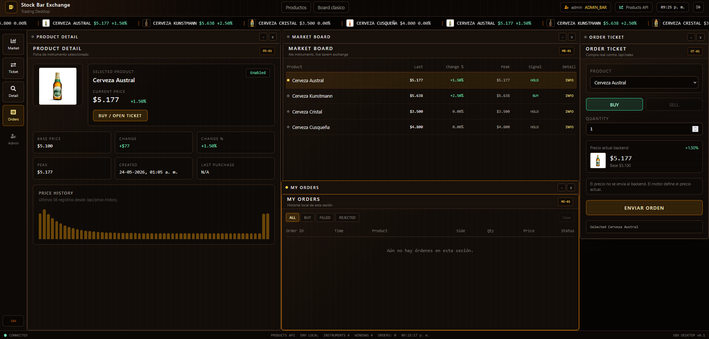

# Merchant Exchange Survival

**Merchant Exchange Survival** is a full-stack economic survival game built on top of a trading desktop architecture.

The player controls a merchant company in a medieval/fantasy market world. The goal is to survive, grow and become wealthy by buying and selling fictional assets, managing cash, building a portfolio, reacting to world news, and handling financial risk.

## Screenshots

### Login


### Trading News


<!-- ### Trading Desktop -->

<!--  -->

<!-- ### Admin Market Controls -->

<!--  -->

## Technical Documentation

- [Resumen tecnico integral del proyecto](docs/RESUMEN-TECNICO-TRADING-BAR-EXCHANGE.md)
- [REQ-001 Trading Desktop](docs/REQ-001-trading-desktop.md)
- [REQ-007 Keycloak](docs/REQ-007-keycloak.md)
- [REQ-008 Docker Compose](docs/REQ-008-docker-compose.md)


The project combines:

* A desktop-style trading UI.
* Movable internal game windows.
* Fictional market assets.
* Player company economy.
* Buy/Sell orders.
* Portfolio and holdings.
* Realized and unrealized P/L.
* World news events.
* Risk system.
* Admin/Game Master controls.
* Keycloak authentication.
* PostgreSQL persistence.
* Docker Compose local demo stack.

## Concept

Merchant Exchange Survival turns a trading terminal into a strategy/survival game.

Instead of trading beers or real stocks, the player trades fictional medieval/fantasy assets such as mines, ports, banks, merchant guilds and research houses.

Example assets:

* Ironhill Mines
* Black Harbor Shipping
* Silvercrown Bank
* Northwind Logistics
* Royal Grain Company
* Arcane Research Guild
* Old Dragon Brewery

The gameplay loop is:

```txt
Buy assets
      ↓
World news changes the market
      ↓
Prices move up or down
      ↓
Portfolio value changes
      ↓
Risk level changes
      ↓
Sell, hold, buy more or survive the crisis
```

## Current Status

Implemented phases:

* Phase 1: Merchant Exchange Survival rebranding.
* Phase 2: Player company, cash and portfolio.
* Phase 3: Buy/Sell orders and realized P/L.
* Phase 4: World News + Risk System.

The application already supports:

* Login with Keycloak.
* Role-based access.
* Asset market board.
* Player company dashboard.
* Portfolio window.
* Investment ticket with BUY and SELL.
* Trade history.
* Guild Herald news feed.
* World events that affect prices.
* Game Master controls for admin users.
* Price history.
* Company value, portfolio value, realized P/L and unrealized P/L.

## Screenshots

> Add updated screenshots here after capturing the new UI.

```txt
docs/images/login.png
docs/images/merchant-command-desk.png
docs/images/company-dashboard.png
docs/images/guild-herald.png
docs/images/game-master-controls.png
```

## Main Features

### Trading Desktop UI

The frontend works like a small desktop operating system for market/game apps.

Internal apps can be opened, moved, focused, minimized and closed.

Current desktop apps:

| App                  | Description                                                                             |
| -------------------- | --------------------------------------------------------------------------------------- |
| Market Board         | Shows fictional assets, current prices, trends and signals                              |
| Asset Detail         | Shows selected asset data and price history                                             |
| Investment Ticket    | Allows BUY and SELL orders                                                              |
| Portfolio            | Shows holdings, average price, market value and unrealized P/L                          |
| Company Dashboard    | Shows cash, company value, portfolio value, realized P/L, unrealized P/L and risk level |
| Trade History        | Shows executed BUY and SELL orders                                                      |
| Guild Herald         | Shows world news that affect the market                                                 |
| Game Master Controls | Allows admin users to trigger market actions and world events                           |

### Player Company Economy

Each authenticated user can have a player company.

The company has:

* Cash
* Debt
* Company value
* Portfolio value
* Realized P/L
* Unrealized P/L
* Reputation
* Risk level

When a player buys an asset:

```txt
Cash decreases
Holding quantity increases
Average price is recalculated
Order is stored
Portfolio is updated
```

When a player sells an asset:

```txt
Cash increases
Holding quantity decreases
Realized P/L is calculated
Order is stored
Portfolio is updated
```

### Portfolio System

The portfolio tracks all player holdings.

Each holding includes:

* Asset
* Quantity
* Average price
* Current price
* Market value
* Unrealized P/L
* Unrealized P/L %

Positions with zero quantity are not displayed.

### Buy/Sell Trading Flow

The main trading endpoint uses orders.

```http
POST /api/orders
```

Example BUY request:

```json
{
  "assetId": 1,
  "side": "BUY",
  "quantity": 5
}
```

Example SELL request:

```json
{
  "assetId": 1,
  "side": "SELL",
  "quantity": 2
}
```

Example response:

```json
{
  "id": 10,
  "assetId": 1,
  "assetName": "Ironhill Mines",
  "side": "SELL",
  "quantity": 2,
  "executedPrice": 5228,
  "totalAmount": 10456,
  "realizedPnl": 256,
  "status": "FILLED",
  "companyCash": 74456,
  "timestamp": "2026-05-28T10:20:00"
}
```

Validation examples:

* BUY is rejected if the company does not have enough cash.
* SELL is rejected if the company does not own enough quantity.
* Orders are executed at the current market price.

### World News System

The game includes a world news system through the **Guild Herald** app.

World news events are not just technical logs. They are gameplay events that affect the market.

Examples:

| Event           | Possible Effect                           |
| --------------- | ----------------------------------------- |
| Royal Contract  | Positive impact on one asset              |
| Mining Accident | Negative impact on mining assets          |
| Port Blockade   | Negative impact on shipping assets        |
| Banking Crisis  | Negative impact on finance/banking assets |
| Harvest Boom    | Positive impact on grain/food assets      |
| Plague Outbreak | Negative impact on several assets         |
| War Rumors      | Mixed impact across sectors               |
| Magic Discovery | Positive impact on arcane/research assets |

Gameplay flow:

```txt
World event generated
      ↓
News appears in Guild Herald
      ↓
Affected asset prices change
      ↓
Price history is stored
      ↓
Portfolio P/L changes
      ↓
Company risk is recalculated
```

### Risk System

The player company has a risk level that is recalculated from its financial situation.

The system considers:

* Cash
* Debt
* Portfolio value
* Company value
* Unrealized P/L
* Portfolio exposure

Risk levels:

* LOW
* MEDIUM
* HIGH
* CRITICAL

### Game Master Controls

Admin users can manually trigger gameplay events and market actions.

Available admin actions include:

* Generate random world event
* Trigger Royal Contract
* Trigger Mining Accident
* Trigger Port Blockade
* Trigger Banking Crisis
* Trigger Harvest Boom
* Trigger Plague Outbreak
* Trigger War Rumors
* Trigger Magic Discovery
* Simulate market boom
* Simulate market crash
* Reset market

## Tech Stack

### Frontend

* React
* TypeScript
* Vite
* TailwindCSS
* Axios
* Keycloak JS
* React RND
* Recharts

### Backend

* Java
* Spring Boot
* Spring Security
* OAuth2 Resource Server
* Spring Data JPA
* PostgreSQL
* OpenAPI / Swagger

### Infrastructure

* Docker
* Docker Compose
* Keycloak
* PostgreSQL

## Architecture

```txt
React Trading Desktop
        |
        v
Keycloak Login
        |
        v
Axios with Bearer Token
        |
        v
Spring Boot API
        |
        v
PostgreSQL
```

Gameplay architecture:

```txt
Player
  |
  v
Merchant Command Desk
  |
  +--> Market Board
  +--> Investment Ticket
  +--> Portfolio
  +--> Company Dashboard
  +--> Trade History
  +--> Guild Herald
  +--> Game Master Controls
        |
        v
Spring Boot Game API
  |
  +--> PlayerCompanyService
  +--> PortfolioService
  +--> OrderService
  +--> WorldEventService
  +--> AdminMarketService
  +--> PriceHistory
  +--> WorldNews
  |
  v
PostgreSQL
```

## Domain Model

Main backend entities:

| Entity          | Description                                  |
| --------------- | -------------------------------------------- |
| Product / Asset | Tradable fictional market asset              |
| PlayerCompany   | Player-controlled merchant company           |
| Holding         | Player position in an asset                  |
| MarketOrder     | BUY or SELL order                            |
| WorldNewsItem   | Gameplay news item generated by world events |
| PriceHistory    | Historical asset price points                |
| MarketEvent     | Technical/audit market event                 |
| Sale            | Legacy-compatible buy wrapper                |

## Main API Endpoints

### Authentication / User

```http
GET /api/me
```

### Assets

```http
GET /api/products
GET /api/products/detailed
GET /api/products/board
POST /api/products
```

### Player Company

```http
GET /api/company/me
```

Returns company economy data such as:

* Cash
* Debt
* Company value
* Portfolio value
* Realized P/L
* Unrealized P/L
* Reputation
* Risk level

### Portfolio

```http
GET /api/portfolio
```

Returns current player holdings.

Example response:

```json
[
  {
    "assetId": 1,
    "assetName": "Ironhill Mines",
    "quantity": 5,
    "averagePrice": 5100,
    "currentPrice": 5228,
    "marketValue": 26140,
    "unrealizedPnl": 640,
    "unrealizedPnlPercent": 2.51
  }
]
```

### Orders

```http
POST /api/orders
GET /api/orders
```

Supports:

* BUY
* SELL
* Realized P/L on SELL
* Cash updates
* Holding updates

### Legacy Sales Compatibility

```http
POST /api/sales
GET /api/sales
```

The sales endpoint remains available as a compatibility wrapper, but the main gameplay trading flow uses `/api/orders`.

### News

```http
GET /api/news
GET /api/news/latest
```

Used by the Guild Herald and notification system.

### Admin / Game Master

```http
POST /api/admin/events/random
POST /api/admin/events/{type}
POST /api/admin/market/crash
POST /api/admin/market/boom
POST /api/admin/market/reset
POST /api/admin/products/{id}/price/up
POST /api/admin/products/{id}/price/down
POST /api/admin/products/{id}/reset
```

Supported world event types:

```txt
ROYAL_CONTRACT
MINING_ACCIDENT
PORT_BLOCKADE
BANKING_CRISIS
HARVEST_BOOM
PLAGUE_OUTBREAK
WAR_RUMORS
MAGIC_DISCOVERY
```

### Price History

```http
GET /api/price-history?productId=1&limit=80
```

### Technical Market Events

```http
GET /api/market-events?limit=100
```

## Authentication And Authorization

The system uses Keycloak for authentication and role-based authorization.

Available roles:

* `VIEWER`
* `TRADER`
* `ADMIN_BAR`

Role behavior:

| Role        | Market | Asset Detail | Investment Ticket | Portfolio | Company Dashboard | Guild Herald | Trade History | Game Master |
| ----------- | -----: | -----------: | ----------------: | --------: | ----------------: | -----------: | ------------: | ----------: |
| `VIEWER`    |    Yes |          Yes |                No |        No |                No |          Yes |            No |          No |
| `TRADER`    |    Yes |          Yes |               Yes |       Yes |               Yes |          Yes |           Yes |          No |
| `ADMIN_BAR` |    Yes |          Yes |               Yes |       Yes |               Yes |          Yes |           Yes |         Yes |

## Docker Compose

Run the full local demo stack:

```bash
docker compose up -d --build
```

Stop services:

```bash
docker compose down
```

Stop and remove volumes:

```bash
docker compose down -v
```

Use a clean start when changing the Keycloak realm or seed data:

```bash
docker compose down -v
docker compose up -d --build
```

## Local URLs

| Service                | URL                                           |
| ---------------------- | --------------------------------------------- |
| Frontend               | `http://localhost:5173`                       |
| Backend API            | `http://localhost:8080`                       |
| Swagger / OpenAPI      | `http://localhost:8080/swagger-ui/index.html` |
| OpenAPI JSON           | `http://localhost:8080/v3/api-docs`           |
| Keycloak               | `http://localhost:8081`                       |
| Keycloak Admin Console | `http://localhost:8081/admin`                 |
| PostgreSQL             | `localhost:5432`                              |

## Test Users

| User     | Password | Role        |
| -------- | -------- | ----------- |
| `viewer` | `viewer` | `VIEWER`    |
| `trader` | `trader` | `TRADER`    |
| `admin`  | `admin`  | `ADMIN_BAR` |

## Local Development

### Backend

```bash
cd stock-bar-backend
mvn spring-boot:run
```

### Frontend

```bash
cd stock-bar-frontend
npm install
npm run dev
```

### Keycloak Configuration

The Docker Compose demo uses Keycloak on port `8081`.

Frontend variables:

```env
VITE_KEYCLOAK_URL=http://localhost:8081
VITE_KEYCLOAK_REALM=stockbar
VITE_KEYCLOAK_CLIENT_ID=stockbar-frontend
```

> Note: The internal Keycloak realm/client names may still use `stockbar` for compatibility, while the visible product branding is Merchant Exchange Survival.

## Validation

Frontend:

```bash
cd stock-bar-frontend
npm install
npm run build
```

Backend:

```bash
cd stock-bar-backend
mvn test
mvn clean package
```

Docker:

```bash
docker compose config
docker compose up -d --build
docker compose ps
```

## Suggested Demo Flow

### Trader Flow

1. Open `http://localhost:5173`.
2. Login as `trader / trader`.
3. Open Company Dashboard.
4. Review initial cash, company value and risk level.
5. Open Market Board.
6. Select an asset, for example Ironhill Mines.
7. Open Investment Ticket.
8. Send a BUY order.
9. Validate cash decreases.
10. Open Portfolio.
11. Validate the new holding appears.
12. Trigger or wait for a world news event.
13. Check Guild Herald.
14. Validate the asset price changed.
15. Check unrealized P/L and company risk.
16. Send a SELL order.
17. Validate cash increases and realized P/L is updated.

### Admin / Game Master Flow

1. Login as `admin / admin`.
2. Open Game Master Controls.
3. Generate a random world event.
4. Trigger a specific event such as Magic Discovery or Port Blockade.
5. Validate Guild Herald shows the news.
6. Validate Market Board prices changed.
7. Validate Price History was updated.
8. Validate the player portfolio reacts to market movements.

## Roadmap

Planned next steps:

* Guild Herald filters:

  * All
  * My Portfolio
  * Positive
  * Negative
  * Critical
* Better notifications:

  * “Affects you” badge when news impacts owned assets
  * Portfolio impact summary in toast notifications
* Risk alerts:

  * Low cash
  * High concentration
  * Negative unrealized P/L
  * Critical risk
* Order Book visual app:

  * Buy orders
  * Sell orders
  * Trades
* Debt / borrow system
* Interest and survival pressure
* Auctions
* AI competitors / rival guilds
* WebSocket or SSE market feed
* Matching engine with real order book
* Flyway or Liquibase migrations
* CI/CD pipeline
* Observability with Prometheus and Grafana
* Cloud deployment

## Purpose

This project was built as a portfolio project to demonstrate:

* Full-stack architecture
* Trading-style frontend design
* Desktop-like web application structure
* Game economy design
* Market simulation logic
* Player portfolio management
* Buy/Sell trading flows
* Realized and unrealized P/L calculation
* World event systems
* Risk calculation
* Secure backend APIs
* Keycloak authentication
* Role-based access control
* PostgreSQL persistence
* Dockerized local environment
* Clean frontend modularization
* Spring Boot backend design

## Project Pitch

**Merchant Exchange Survival** is a full-stack economic survival game where players control a merchant company inside a fictional medieval/fantasy market.

Players buy and sell assets, manage cash, build a portfolio, react to world news, monitor risk, and try to survive market shocks.

Built with React, TypeScript, Spring Boot, PostgreSQL, Keycloak and Docker Compose.