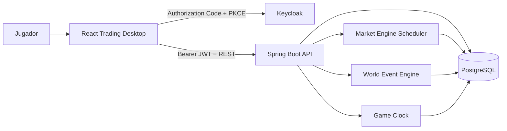

# Arquitectura De Merchant Exchange Survival

## 1. Proposito

Este documento describe el sistema AS-IS a partir del codigo actual. Su objetivo
es explicar que hace el proyecto, como se conectan sus partes, cuales son sus
reglas reales y donde termina hoy la implementacion.

Merchant Exchange Survival es una simulacion economica de supervivencia. Cada
usuario administra una compania separada, pero todos observan y operan sobre un
mercado global compartido. Las decisiones del jugador, la presion agregada de
ordenes, los eventos de mundo y el paso de los dias modifican la partida.

## 2. Diferencia Frente Al Proyecto Original

La base heredada de Trading Bar Exchange aporto:

- Catalogo de productos.
- Compra simple.
- Actualizacion de precios.
- Panel administrativo.
- Autenticacion por roles.
- Desktop visual de trading.

La evolucion a Merchant Exchange Survival agrego un dominio nuevo:

- Compania persistente por jugador.
- Caja, deuda, valor de empresa, reputacion y riesgo.
- Holdings con costo promedio.
- Compra y venta con P/L realizado.
- Dias de juego y gasto operativo.
- Runway de caja.
- Noticias narrativas con impacto economico.
- Sectores y eventos de mundo.
- Quiebra y victoria.
- UX medieval/fantasy enfocada en supervivencia.

Por compatibilidad siguen existiendo nombres tecnicos `stockbar` y el endpoint
historico `/api/sales`, pero ya no representan la arquitectura principal.

## 3. Vista General



Caracteristicas estructurales:

- Frontend SPA.
- Backend monolitico modular por controllers, services y repositories.
- Persistencia relacional.
- Mercado global.
- Estado de compania aislado por identidad autenticada.
- Comunicacion HTTP REST.
- Actualizacion visual por polling.
- Procesos periodicos con `@Scheduled`.

## 4. Estructura Del Repositorio

```text
merchant-exchange-survival/
  stock-bar-frontend/
    src/auth/
    src/services/
    src/trading-desktop/
      apps/
      components/
      core/
      hooks/
      styles/
  stock-bar-backend/
    src/main/java/com/francisco/stockbar/
      config/
      controller/
      dto/
      exception/
      model/
      repository/
      service/
    src/main/resources/
      application.yml
      data.sql
  docker/keycloak/
    stockbar-realm.json
    themes/merchant-exchange/
  docs/
  docker-compose.yml
```

## 5. Frontend

### 5.1 Entrada Y Enrutamiento

`main.jsx` monta:

- `BrowserRouter`
- `AuthProvider`
- `TickerProvider`
- Aplicacion principal

Rutas actuales:

| Ruta | Estado |
|---|---|
| `/` | Trading Desktop principal |
| `/products` | Vista heredada de productos |
| `/board` | Board heredado |

Las rutas heredadas siguen enlazadas desde el TopBar. Son deuda de migracion y
no deben confundirse con el flujo canonico del juego.

### 5.2 Autenticacion

`AuthContext.tsx` inicializa Keycloak con:

- `check-sso`
- Authorization Code
- PKCE `S256`
- Renovacion preventiva del token

Axios agrega el token Bearer a las llamadas. El frontend interpreta roles para
mostrar aplicaciones, pero la autorizacion definitiva vive en Spring Security.

### 5.3 Desktop

`TradingDesktop.tsx` coordina:

- Producto seleccionado.
- Ventanas abiertas.
- Orden visual y foco.
- Carga periodica de productos.
- Carga periodica de noticias.
- Apertura inicial segun rol.

Ventanas iniciales:

- `TRADER` y `ADMIN_BAR`: Company, Market y Ticket.
- `VIEWER`: Company, Market y Detail.

`useDesktopWindows` encapsula movimiento, resize, minimize, focus y limites del
viewport. Cada aplicacion se registra en el catalogo del desktop.

### 5.4 Aplicaciones

#### Company Keep

Presenta:

- Cash.
- Debt.
- Company value.
- Realized P/L.
- Daily burn.
- Cash runway.
- Reputation.
- Risk level.
- Game day.
- Company status.
- Principales holdings.

Permite terminar el dia a `TRADER` y `ADMIN_BAR`.

#### Market Board

Presenta activos globales con:

- Precio actual.
- Cambio frente al precio base.
- Precio base.
- Maximo registrado.
- Estado enabled.
- Acceso a detalle y ticket.

La columna de senal BUY/WATCH/HOLD es una heuristica visual del frontend. No es
una recomendacion del backend ni una prediccion del motor de mercado.

#### Royal Ticket

Permite:

- Seleccionar BUY o SELL.
- Elegir activo y cantidad.
- Ver una estimacion con el precio actual.
- Enviar una orden al backend.

El importe mostrado antes de enviar es estimativo. El backend vuelve a leer el
precio y es la autoridad de ejecucion.

#### Vault

Muestra holdings positivos:

- Cantidad.
- Costo promedio.
- Precio actual.
- Valor de mercado.
- P/L no realizado.
- Asignacion dentro del portfolio.

#### Trade Ledger

Combina:

- Ordenes FILLED persistidas por backend.
- Intentos rechazados guardados localmente durante la sesion.

El backend define `REJECTED` en el enum, pero el servicio actual solo persiste
ordenes completadas. Limpiar los rechazados en la UI no borra datos del backend.

#### Guild Herald

Consulta noticias y permite filtrar:

- Todas.
- Relacionadas con el portfolio.
- Positivas.
- Negativas.
- Criticas.

La UI compara la fecha de adquisicion del holding con la fecha de la noticia
para contextualizar si el jugador estaba expuesto cuando ocurrio.

#### Asset Chronicle

Muestra metadatos e historial de precio del activo seleccionado.

#### Game Master

Solo para `ADMIN_BAR`. Permite:

- Crash y boom global.
- Reset de mercado.
- Subir, bajar o restaurar un producto.
- Disparar evento aleatorio.
- Disparar un tipo de evento concreto.
- Consultar eventos tecnicos.

El control visual de volumen no posee endpoint persistente; es estado local.

### 5.5 Actualizacion De Datos

El frontend usa polling:

| Recurso | Frecuencia |
|---|---:|
| Productos | 5 segundos |
| Noticias | 10 segundos |

No existen actualmente:

- WebSocket.
- Server-Sent Events.
- Cache cliente normalizada.
- Store global como Redux o Zustand.

### 5.6 Catalogo Visual

`visualCatalog.tsx` centraliza iconos de aplicaciones y activos. La identidad
visual combina:

- Fondo oscuro.
- Dorado y bronce.
- Tipografia de fantasia.
- Marcos y ventanas de terminal.
- Iconografia semantica por sector y modulo.

## 6. Backend

### 6.1 Capas

```text
Controller
  valida acceso HTTP y delega
Service
  aplica reglas de negocio y transacciones
Repository
  consulta y persiste entidades JPA
Model
  representa el dominio persistente
DTO
  define contratos HTTP
```

El backend usa `ApiException` y `ApiExceptionHandler` para devolver errores con:

- `status`
- `error`
- `message`
- `timestamp`

### 6.2 Entidades

#### Product

Representa un activo global:

- `name`
- `sector`
- `basePrice`
- `currentPrice`
- `maxPrice`
- `imageUrl`
- `enabled`
- timestamps
- ultima compra

#### PlayerCompany

Una compania por username:

- `cash`
- `debt`
- `companyValue`
- `realizedPnl`
- `reputation`
- `riskLevel`
- `gameDay`
- `status`
- `dailyBurnRate`
- `cashRunwayDays`
- `criticalDays`
- `victoryTarget`
- timestamps y razon de quiebra

Valores iniciales:

| Campo | Valor |
|---|---:|
| Cash | 100,000 |
| Debt | 0 |
| Realized P/L | 0 |
| Reputation | 50 |
| Risk | LOW |
| Game day | 1 |
| Status | ACTIVE |
| Daily burn | 500 |
| Cash runway | 200 |
| Victory target | 1,000,000 |

#### Holding

Posicion de una compania en un producto:

- Cantidad.
- Precio promedio ponderado.
- Relacion unica compania-producto.
- Fechas de creacion y actualizacion.

#### MarketOrder

Ejecucion de trading:

- BUY o SELL.
- Cantidad.
- Precio ejecutado.
- Importe total.
- P/L realizado.
- Estado.
- Timestamp.

#### WorldNewsItem

Evento narrativo visible al jugador:

- Tipo.
- Titulo y descripcion.
- Direccion.
- Porcentaje de impacto concreto.
- Producto o sector afectado.
- Severidad.
- Timestamp.

#### PriceHistory

Serie historica por producto.

#### MarketEvent

Auditoria tecnica de cambios, ordenes, eventos y transiciones de estado.

#### Sale

Entidad heredada conservada por compatibilidad con `/api/sales`.

## 7. Compania Y Riesgo

El valor de compania se calcula como:

```text
companyValue = cash + marketValue(holdings) - debt
```

El P/L no realizado usa:

```text
unrealized = (currentPrice - averagePrice) * quantity
```

El riesgo se deriva de liquidez, deuda y rendimiento:

### CRITICAL

Se activa, entre otras condiciones, si:

- Company value <= 0.
- Cash < 0.
- Runway <= 2 dias.
- Ratio deuda/valor >= 60%.
- Perdida no realizada <= -30%.

### HIGH

- Runway <= 5 dias.
- Ratio de deuda >= 35%.
- Perdida no realizada <= -15%.

### MEDIUM

- Runway <= 10 dias.
- Ratio de deuda >= 15%.
- Perdida no realizada <= -5%.

En otro caso el riesgo es LOW.

## 8. Ordenes

Contrato principal:

```http
POST /api/orders
Content-Type: application/json

{
  "assetId": 11,
  "side": "BUY",
  "quantity": 10
}
```

### 8.1 BUY

1. Valida compania ACTIVE.
2. Valida producto enabled.
3. Lee el precio actual.
4. Comprueba fondos.
5. Descuenta cash.
6. Crea o actualiza el holding.
7. Recalcula costo promedio ponderado.
8. Persiste orden FILLED.
9. Persiste `Sale` de compatibilidad.
10. Registra evento tecnico.
11. Recalcula la compania.

### 8.2 SELL

1. Valida compania ACTIVE.
2. Comprueba holding y cantidad.
3. Suma el ingreso a cash.
4. Reduce o elimina el holding.
5. Calcula P/L realizado.
6. Acumula P/L realizado en la compania.
7. Persiste orden y evento.
8. Recalcula la compania.

Formula:

```text
realizedPnl = (executedPrice - averagePrice) * quantity
```

No hay:

- Ordenes limite.
- Ordenes pendientes.
- Ejecucion parcial.
- Spread bid/ask.
- Matching entre usuarios.
- Slippage dentro de la transaccion.

## 9. Motor De Mercado

`MarketEngineService` ejecuta un tick periodico, habilitado por defecto.

Configuracion actual:

| Propiedad | Valor |
|---|---:|
| Tick | 30 segundos |
| Ventana de ordenes | 60 segundos |
| Presion minima | 5 unidades |
| Liquidez de referencia | 100 |
| Factor BUY | 0.001 |
| Factor SELL | 0.0015 |
| Impacto maximo por tick | 4% |
| Reversion al valor base | 0.5% |
| Limite inferior | 0.2 x base |
| Limite superior | 5 x base |

Proceso:

1. Suma cantidades BUY y SELL recientes por producto.
2. Calcula presion neta.
3. Ignora presion por debajo del minimo.
4. Aplica impacto proporcional con tope.
5. Aplica reversion parcial hacia el precio base.
6. Limita el precio al rango permitido.
7. Persiste precio, historial y evento si cambia.

La ventana es movil. Mientras una orden permanezca dentro del lookback puede ser
considerada en mas de un tick. Este comportamiento forma parte del modelo actual
y debe revisarse si se busca impacto de orden exactamente una sola vez.

## 10. Eventos De Mundo

Los eventos cambian precios inmediatamente y generan noticia e historial.

| Evento | Objetivo | Impacto actual |
|---|---|---|
| ROYAL_CONTRACT | Activo aleatorio | +5% a +15% |
| MINING_ACCIDENT | Mineria | -8% a -22% |
| PORT_BLOCKADE | Shipping | -8% a -18% |
| BANKING_CRISIS | Banca | -10% a -25% |
| HARVEST_BOOM | Grain/Food | +6% a +16% |
| PLAGUE_OUTBREAK | Todo el mercado | -5% a -14% |
| WAR_RUMORS | Sectores mixtos | +3% a +9% o -4% a -12% |
| MAGIC_DISCOVERY | Arcane | +8% a +20% |

En WAR_RUMORS:

- Mining, Banking y Arcane tienden a subir.
- Shipping, Logistics, Grain y Food tienden a bajar.

La noticia registra el resultado ocurrido. Por eso una alerta puede mostrar, por
ejemplo, una perdida cercana a 17%, pero no existe un 17% fijo para toda guerra.

Fuentes de eventos:

- Game Master.
- Evento aleatorio al terminar el dia.
- Scheduler global opcional.

El scheduler global esta deshabilitado por defecto. El evento aleatorio por fin
de dia esta habilitado con probabilidad de 35%.

## 11. Reloj De Juego

`POST /api/game/end-day` procesa una jornada de la compania autenticada:

1. Verifica que siga ACTIVE.
2. Incrementa `gameDay`.
3. Descuenta `dailyBurnRate`.
4. Aplica interes diario si existe deuda.
5. Puede disparar un evento aleatorio global.
6. Recalcula valor, runway y riesgo.
7. Actualiza dias criticos.
8. Evalua quiebra.
9. Evalua victoria.

Configuracion:

| Propiedad | Valor |
|---|---:|
| Gasto diario inicial | 500 |
| Interes diario de deuda | 0.1% |
| Evento al terminar dia | Habilitado |
| Probabilidad | 35% |
| Liquidacion forzada | Deshabilitada |

Quiebra:

- Company value <= 0.
- Tres dias criticos consecutivos.
- Reputation <= 0.

Victoria:

- Company value >= victory target.

Una compania BANKRUPT o VICTORIOUS ya no procesa nuevas jornadas ni ordenes.

## 12. API

### 12.1 Lectura Compartida

| Metodo | Endpoint | Descripcion |
|---|---|---|
| GET | `/api/me` | Identidad y roles |
| GET | `/api/products` | Productos |
| GET | `/api/products/detailed` | Productos detallados |
| GET | `/api/products/board` | Proyeccion de board |
| GET | `/api/price-history` | Historial |
| GET | `/api/market-events` | Eventos tecnicos |
| GET | `/api/news` | Noticias |
| GET | `/api/news/latest` | Ultima noticia |
| GET | `/api/company/me` | Compania actual |
| GET | `/api/portfolio` | Portfolio actual |

### 12.2 Juego Y Trading

| Metodo | Endpoint | Descripcion |
|---|---|---|
| GET | `/api/game/state` | Estado de supervivencia |
| POST | `/api/game/end-day` | Terminar jornada |
| GET | `/api/orders` | Ordenes de la compania |
| POST | `/api/orders` | Ejecutar BUY o SELL |
| GET | `/api/sales` | Ventas legacy |
| POST | `/api/sales` | Adaptador legacy de BUY |

### 12.3 Administracion

| Metodo | Endpoint | Descripcion |
|---|---|---|
| DELETE | `/api/admin/reset` | Reset administrativo amplio |
| POST | `/api/admin/reset-prices` | Restaurar precios |
| POST | `/api/admin/market/crash` | Caida global |
| POST | `/api/admin/market/boom` | Subida global |
| POST | `/api/admin/market/reset` | Reset de mercado |
| POST | `/api/admin/products/{id}/price/up` | Subir activo |
| POST | `/api/admin/products/{id}/price/down` | Bajar activo |
| POST | `/api/admin/products/{id}/reset` | Restaurar activo |
| POST | `/api/admin/events/random` | Evento aleatorio |
| POST | `/api/admin/events/{type}` | Evento concreto |

## 13. Seguridad

Keycloak:

- Realm: `stockbar`.
- Frontend client: `stockbar-frontend`.
- Resource client: `stockbar-api`.
- Flujo principal: Authorization Code + PKCE.

Spring Security convierte roles de:

- `realm_access.roles`
- `resource_access.stockbar-api.roles`
- otros clientes de `resource_access`

Matriz efectiva:

| Recurso | VIEWER | TRADER | ADMIN_BAR |
|---|---:|---:|---:|
| Productos, noticias, historia | Si | Si | Si |
| Compania y portfolio propios | Si | Si | Si |
| Game state | No | Si | Si |
| End day | No | Si | Si |
| Ordenes y sales | No | Si | Si |
| Crear productos | No | No | Si |
| Admin | No | No | Si |

## 14. Persistencia

Tablas principales:

```text
products
player_company
holdings
market_orders
world_news_items
price_history
market_events
sales
```

No se usa Flyway ni Liquibase. El esquema depende de:

- Hibernate `ddl-auto=update`.
- Migracion defensiva `PlayerCompanySurvivalSchemaMigration`.
- `data.sql` para activos demo.

La migracion defensiva agrega, rellena y establece columnas survival no nulas
antes de que Hibernate valide el esquema. Este patron existe porque
`ddl-auto=update` no resuelve de forma segura columnas nuevas NOT NULL sobre
filas antiguas.

### Riesgo De Reinicio

En Docker, `SPRING_SQL_INIT_MODE=always` ejecuta `data.sql`. El upsert actual
actualiza `current_price`, `max_price` y otros campos demo cuando el producto ya
existe. En consecuencia, reiniciar el backend puede restaurar precios del
mercado sin borrar holdings, ordenes o companias.

Esto es aceptable para una demo reiniciable, pero no para una simulacion
persistente de produccion. La solucion futura debe separar:

- Seed inicial idempotente.
- Migraciones de esquema.
- Estado vivo del mercado.

## 15. Docker Compose

Servicios:

| Servicio | Puerto host | Funcion |
|---|---:|---|
| postgres | 5432 | Persistencia |
| keycloak | 8081 | Identidad |
| keycloak-config | - | Aplica theme de login |
| backend | 8080 | API y motores |
| frontend | 5173 | SPA Vite |

Los volumenes conservan PostgreSQL y Keycloak. El realm se importa solo al crear
el estado inicial; `keycloak-config` aplica el theme de manera idempotente.

## 16. Configuracion Relevante

Propiedades principales en `application.yml`:

```text
market.engine.*
game.survival.*
game.events.*
price.legacy-enabled
spring.jpa.hibernate.ddl-auto
spring.sql.init.mode
```

Los schedulers legacy de precio estan deshabilitados. Activarlos junto con el
motor nuevo mezclaria dos modelos de precio y no corresponde al gameplay actual.

## 17. Cobertura Automatizada Existente

Backend:

- Carga de contexto Spring.
- Adaptador legacy de Sale.
- BUY, promedio ponderado y fondos insuficientes.
- SELL, reduccion/eliminacion de holding y P/L realizado.
- Presion BUY/SELL.
- Umbral, reversion y limites de precio.
- Incremento de dia y gasto.
- Runway.
- Dias criticos.
- Quiebra y victoria.
- Bloqueo de procesamiento despues de una condicion terminal.

Frontend:

- No hay script ni suite automatizada declarada en `package.json`.

Este analisis no implica que las pruebas hayan sido ejecutadas durante la
actualizacion documental.

## 18. Fortalezas

- El dominio survival ya esta modelado en backend y UI.
- La autoridad economica vive en el servidor.
- La identidad separa companias y portfolios.
- Existe trazabilidad mediante ordenes, noticias, historial y eventos.
- Los motores se pueden ajustar por configuracion.
- La estetica visual es coherente con el universo del juego.
- `/api/sales` permite una migracion gradual sin bloquear el contrato nuevo.

## 19. Deuda Tecnica Y Riesgos

Alta prioridad:

1. Separar migraciones y seed de datos; evitar reset de precios al reinicio.
2. Definir si cada orden debe impactar una sola vez o durante toda la ventana.
3. Crear mecanismos jugables para deuda y reputacion.
4. Implementar o eliminar la configuracion de liquidacion forzada.
5. Migrar o retirar las rutas frontend heredadas.

Prioridad media:

1. Agregar tests de integracion para seguridad y ownership.
2. Agregar tests frontend para los flujos de supervivencia.
3. Unificar errores de validacion no cubiertos por `ApiException`.
4. Definir paginacion para noticias, ordenes, historia y eventos.
5. Evitar polling completo cuando aumente la escala.
6. Endurecer secretos, CORS y configuracion para entornos no locales.

Producto:

1. Contratos, creditos o prestamos.
2. Reputacion afectada por decisiones.
3. Costos variables por tamano de compania.
4. Eventos encadenados y rumores previos al impacto.
5. Objetivos, dificultad y escenarios.
6. Mercado multijugador con impacto y fairness definidos.

## 20. Direccion Arquitectonica Recomendada

Sin reescribir el sistema, la evolucion natural es:

1. Introducir Flyway con baseline del esquema actual.
2. Convertir `data.sql` en seed solo-si-no-existe.
3. Mantener `/api/orders` como unico contrato principal.
4. Retirar `/api/sales` cuando las vistas legacy desaparezcan.
5. Separar comandos de juego de consultas si aumenta la complejidad.
6. Publicar eventos internos para ordenar efectos de trading, noticias y dias.
7. Agregar una API de escenarios/configuracion para balance.
8. Evaluar SSE para precios y noticias antes de adoptar WebSocket completo.

## 21. Fuente De Verdad

Orden recomendado para entender el proyecto:

1. Codigo actual.
2. Este documento.
3. `GAMEPLAY.md`.
4. REQ especializados.
5. `CODEX_PROJECT_MEMORY.md`.
6. Nota historica de Trading Bar Exchange.

Cuando una nota historica contradiga el codigo actual, prevalece el codigo.
