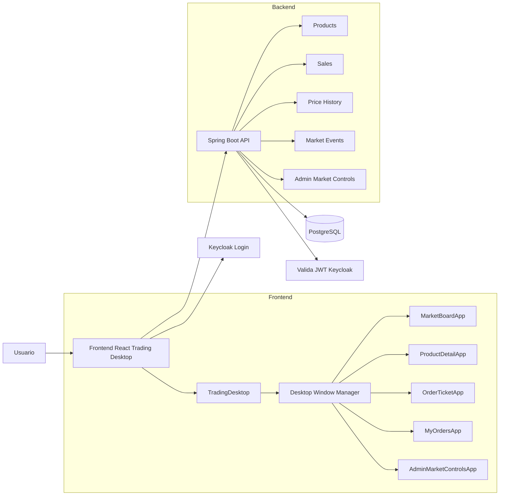
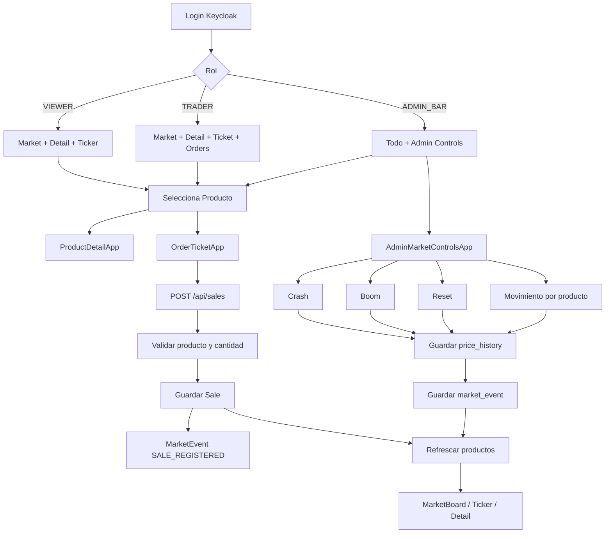
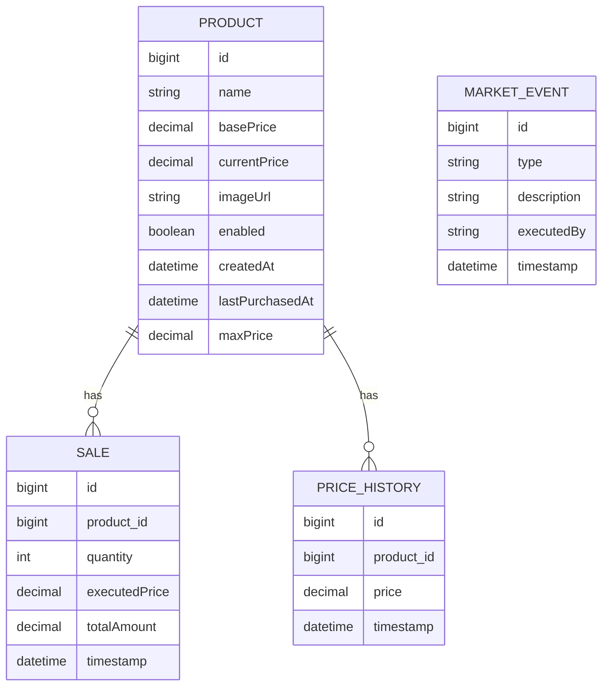
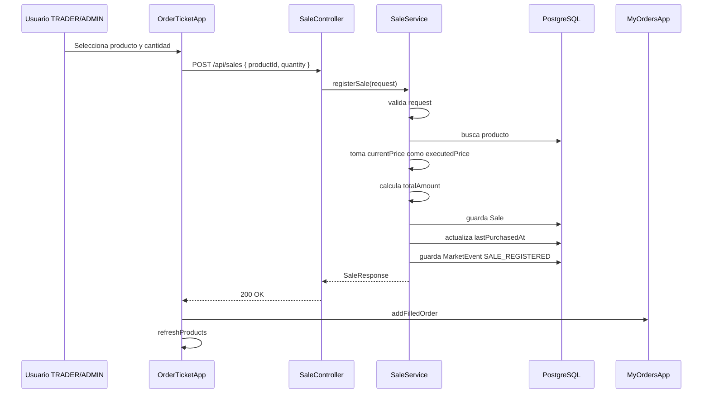
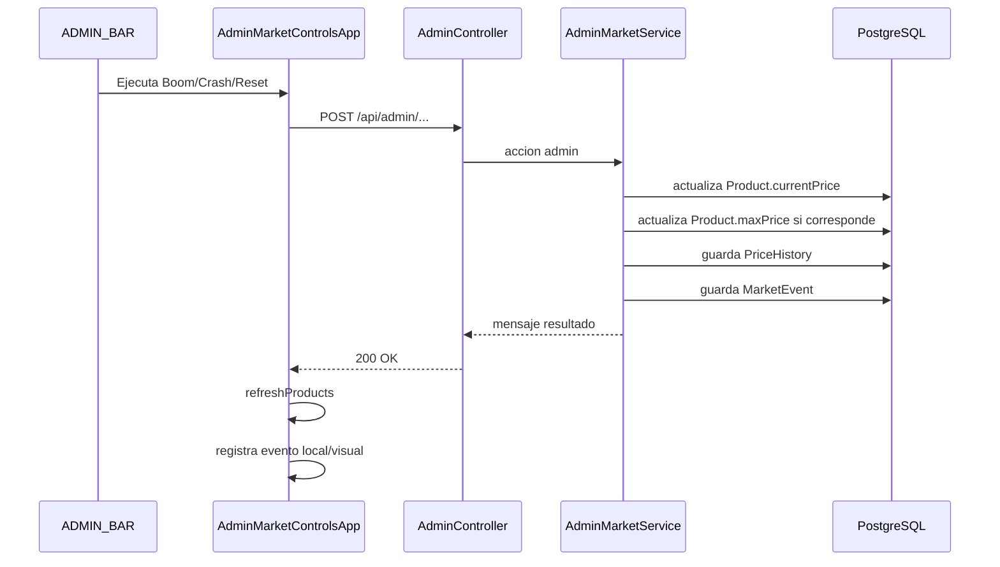
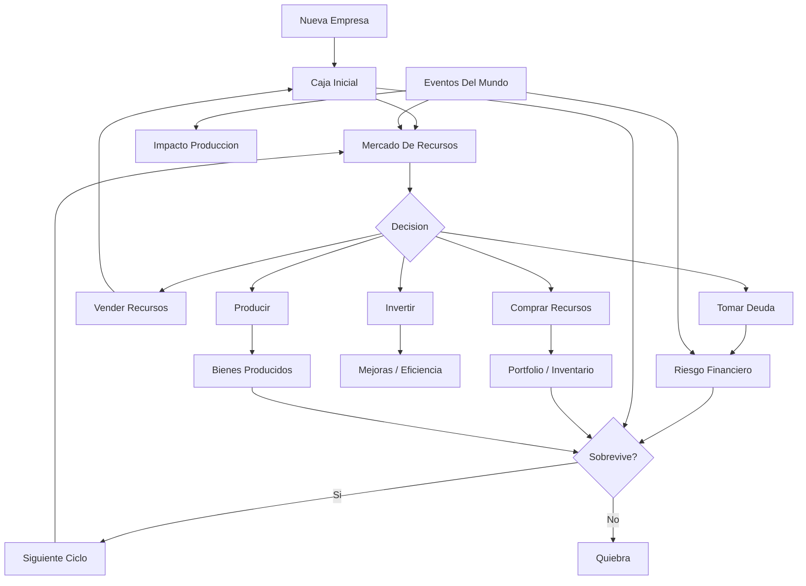

# Resumen Tecnico Integral - Trading Bar Exchange

Este documento resume lo construido en el proyecto **Trading Bar Exchange / Stock Bar Exchange** durante la evolucion del frontend, backend, seguridad, datos, Docker y arquitectura general.

La idea del sistema es convertir productos de bar, principalmente cervezas, en instrumentos negociables como si fueran activos de una bolsa. El usuario ve un desktop tipo terminal financiera, revisa precios, selecciona productos, envia ordenes de compra y, si tiene permisos de administracion, manipula el mercado simulado con crash, boom, reset y movimientos por producto.

Este documento tambien deja una base conceptual para un siguiente proyecto: un juego de supervivencia con estetica de bolsa de valores, donde el jugador funciona como una empresa.

---

## 1. Vision Del Proyecto

**Stock Bar Exchange** es una aplicacion full-stack que mezcla:

- Una bolsa de valores simulada.
- Un bar con productos negociables.
- Un desktop web tipo terminal financiera.
- Roles de usuario con Keycloak.
- Backend Spring Boot con motor de precios.
- PostgreSQL como persistencia.
- Docker Compose para demo local completa.

La logica central:

1. Cada producto tiene un precio base.
2. Cada producto tiene un precio actual.
3. Las ventas pueden empujar precios hacia arriba.
4. La inactividad puede degradar precios.
5. El admin puede manipular el mercado.
6. Cada movimiento relevante puede quedar registrado como historial de precio o evento de mercado.
7. La UI muestra todo en una experiencia tipo trading desktop.

---

## 2. Evolucion Implementada Por Requerimientos

### REQ-001 - Trading Desktop

Se creo una nueva pantalla principal para `/` con estructura tipo desktop financiero:

- TopBar.
- TickerTape.
- Sidebar.
- Workspace.
- StatusBar.
- Estetica oscura medieval/nordica/fantasy market.
- MarketBoard.
- OrderTicket.
- Conexion real a `GET /api/products`.
- Compra real usando `POST /api/sales`.
- Rutas legacy preservadas:
  - `/products`
  - `/board`

### REQ-002 - Modularizacion En Apps Internas

Se ordeno la arquitectura frontend:

- `src/trading-desktop/apps/`
- `src/trading-desktop/components/`
- `src/trading-desktop/hooks/`
- `src/trading-desktop/services/`

Se separaron responsabilidades:

- Las apps muestran UI de negocio.
- Los hooks manejan estado compartido.
- Los services llaman al backend.
- `TradingDesktop` coordina la experiencia completa.

### REQ-003 - Desktop Window Manager

Se transformaron las apps internas en ventanas movibles:

- Ventanas dentro del Workspace.
- Abrir app desde Sidebar.
- Enfocar ventana.
- Mover ventana.
- Redimensionar ventana.
- Cerrar ventana.
- Minimizar/restaurar ventana.
- Control de `zIndex`.

Se uso `react-rnd` para drag/resize.

### REQ-004 - Product Detail App

Se agrego `ProductDetailApp`:

- Muestra detalle del producto seleccionado.
- Imagen.
- Precio actual.
- Precio base.
- Variacion absoluta.
- Variacion porcentual.
- Max price / peak.
- Enabled.
- CreatedAt.
- LastPurchasedAt.
- Historial de precio real desde `GET /api/price-history`.
- Accion para abrir `OrderTicket`.

### REQ-004B - Pulido Visual

Se mejoro la usabilidad:

- MarketBoard mas compacto.
- ProductDetail con imagen mejor contenida.
- OrderTicket con texto mas claro.
- Boton principal cambiado a `ENVIAR ORDEN`.
- SELL visible pero no operativo.
- Estados de backend mas claros.
- StatusBar con estado de conexion, productos, ventanas y ordenes.

### REQ-005 - My Orders App

Se agrego `MyOrdersApp`:

- Historial local de ordenes de la sesion.
- Ordenes `FILLED`.
- Ordenes `REJECTED`.
- Filtros:
  - All
  - BUY
  - FILLED
  - REJECTED
- Contador de ordenes en StatusBar.

El historial vive en memoria del frontend, no en backend persistente todavia.

### REQ-005B - Diagnostico De Errores

Se mejoro el manejo de errores:

- Helper `normalizeApiError`.
- Captura de status HTTP.
- Captura de `response.data`.
- Captura de mensaje tecnico.
- Mensaje amigable para usuario.
- Registro de errores en ordenes rechazadas.
- Manejo especifico para:
  - Backend offline.
  - Timeout.
  - Error 500.
  - Error inesperado.

### REQ-009 - Admin Market Controls

Se creo `AdminMarketControlsApp`:

- Disponible solo para `ADMIN_BAR`.
- Simular crash general.
- Simular boom general.
- Reset market.
- Subir precio por producto.
- Bajar precio por producto.
- Resetear precio por producto.
- Simular volumen local.
- Ver Market Events.

Luego se conecto con endpoints reales del backend.

### Backend - Sales Robusto

Se robustecio `POST /api/sales`:

- Validacion de request.
- Validacion de `productId`.
- Validacion de `quantity`.
- Validacion de producto existente.
- Validacion de producto enabled.
- Guardado de `executedPrice`.
- Guardado de `totalAmount`.
- Actualizacion de `lastPurchasedAt`.
- Registro de evento `SALE_REGISTERED`.
- Respuesta con `SaleResponse`.
- Errores esperables con `400`, `404`, `409`.

### Backend - Admin Real

Se conectaron acciones reales:

- `POST /api/admin/market/crash`
- `POST /api/admin/market/boom`
- `POST /api/admin/market/reset`
- `POST /api/admin/products/{id}/price/up`
- `POST /api/admin/products/{id}/price/down`
- `POST /api/admin/products/{id}/reset`

Cada accion puede:

- Actualizar `currentPrice`.
- Actualizar `maxPrice` si corresponde.
- Guardar `price_history`.
- Guardar `market_event`.

### Backend - Price History Y Market Events

Se agrego:

- `GET /api/price-history?productId=...&limit=80`
- `GET /api/market-events?limit=100`

Price history devuelve DTO liviano:

- `timestamp`
- `price`

Market events devuelve:

- `id`
- `type`
- `description`
- `executedBy`
- `timestamp`

### REQ-007 - Keycloak

Se integro autenticacion y autorizacion:

- Keycloak frontend.
- Spring Security OAuth2 Resource Server.
- JWT.
- Roles:
  - `VIEWER`
  - `TRADER`
  - `ADMIN_BAR`
- Sidebar cambia por rol.
- Endpoints protegidos por rol.
- Token Bearer en Axios.
- Login/logout en TopBar.
- Endpoint `GET /api/me`.

### REQ-008 - Docker Compose

Se creo stack completo:

- PostgreSQL.
- Keycloak.
- Backend.
- Frontend.

Tambien:

- Import de realm Keycloak.
- Usuarios demo.
- Dockerfiles.
- Healthchecks.
- Documentacion de ejecucion local.

---

## 3. Arquitectura General



### Flujo Mental Del Sistema

```text
Usuario autenticado
  -> Trading Desktop
    -> Sidebar segun rol
      -> Abre ventanas internas
        -> MarketBoard muestra productos
        -> ProductDetail muestra seleccionado e historial
        -> OrderTicket envia compra
        -> MyOrders registra resultado local
        -> AdminMarketControls manipula precios si es ADMIN_BAR

Backend
  -> Protege endpoints por JWT/roles
  -> Lee productos desde PostgreSQL
  -> Registra ventas
  -> Calcula executedPrice y totalAmount
  -> Ejecuta schedulers de precio
  -> Guarda price_history
  -> Guarda market_event
```

---

## 4. Mapa Conceptual De Flujo De Negocio



---

## 5. Frontend

### Stack

- React 18.
- TypeScript.
- Vite.
- TailwindCSS.
- Axios.
- Keycloak JS.
- React Router.
- React Icons.
- React RND.
- Recharts / lightweight-charts disponibles para graficos.

### Entrada De La Aplicacion

Archivo:

- `stock-bar-frontend/src/main.jsx`

Responsabilidad:

- Monta React.
- Usa `BrowserRouter`.
- Envuelve con `AuthProvider`.
- Envuelve con `TickerProvider`.
- Renderiza `MainRouter`.

### Router Principal

Archivo:

- `stock-bar-frontend/src/router/MainRouter.jsx`

Rutas:

- `/` -> `TradingDesktop`, protegido por `RequireAuth`.
- `/products` -> vista legacy de productos, protegida.
- `/board` -> market board clasico, protegido.

Funcion clave:

- `protectedRoute(element)`: envuelve una ruta con `RequireAuth`.

---

## 6. Autenticacion Frontend

### `AuthContext.tsx`

Archivo:

- `stock-bar-frontend/src/auth/AuthContext.tsx`

Responsabilidades:

- Inicializar Keycloak.
- Mantener estado:
  - `isReady`
  - `isAuthenticated`
  - `token`
  - `user`
- Exponer:
  - `login()`
  - `logout()`
  - `refreshToken()`
  - `hasAnyRole()`
- Construir usuario desktop con:
  - `name`
  - `username`
  - `role`
  - `roles`
- Extraer roles desde:
  - `realmAccess.roles`
  - `resourceAccess.*.roles`
- Registrar proveedor de token para Axios.

Funciones importantes:

- `toUserRole(role)`: convierte string a rol valido.
- `extractRoles()`: toma roles del token Keycloak.
- `buildUser()`: arma `DesktopUser`.
- `LoginScreen()`: pantalla inicial de login.
- `AuthProvider()`: provider global.
- `useAuth()`: hook de consumo.
- `RequireAuth()`: bloquea UI si no hay sesion.

### `keycloak.ts`

Archivo:

- `stock-bar-frontend/src/auth/keycloak.ts`

Responsabilidades:

- Crear instancia Keycloak.
- Leer variables Vite:
  - `VITE_KEYCLOAK_URL`
  - `VITE_KEYCLOAK_REALM`
  - `VITE_KEYCLOAK_CLIENT_ID`
- Exponer `initKeycloak`.

---

## 7. Trading Desktop Frontend

### `TradingDesktop.tsx`

Archivo:

- `stock-bar-frontend/src/trading-desktop/TradingDesktop.tsx`

Responsabilidades:

- Coordinar estado global del desktop.
- Definir apps iniciales segun rol.
- Mantener `selectedInstrumentId`.
- Consumir `useProductsFeed`.
- Consumir `useDesktopWindows`.
- Consumir `useLocalOrders`.
- Consumir `useMarketEvents`.
- Renderizar:
  - `TopBar`
  - `TickerTape`
  - `Sidebar`
  - `Workspace`
  - `StatusBar`
- Pasar props compartidas a las apps internas.
- Evitar abrir apps no permitidas por rol.
- Cerrar ventanas si el usuario cambia de rol y pierde permiso.

Logica importante:

- `initialApps`:
  - `TRADER` y `ADMIN_BAR`: abre `market` y `ticket`.
  - `VIEWER`: abre `market` y `detail`.
- Seleccion automatica:
  - Si llegan productos y no hay seleccionado, selecciona el primero.
- `openAllowedWindow(appId)`:
  - Solo abre si `canOpenDesktopApp` permite el rol.

---

## 8. Tipos Frontend

Archivo:

- `stock-bar-frontend/src/trading-desktop/types.ts`

Tipos principales:

- `DesktopAppId`
  - `market`
  - `ticket`
  - `detail`
  - `orders`
  - `admin`
- `FeedMode`
  - `products-api`
  - `offline`
- `Trend`
  - `up`
  - `down`
  - `flat`
- `UserRole`
  - `ADMIN_BAR`
  - `TRADER`
  - `VIEWER`
- `DesktopUser`
- `TradingInstrument`
- `DesktopWindow`
- `DesktopAppRenderProps`
- `LocalOrder`
- `LocalOrderDraft`
- `MarketEvent`
- `MarketEventDraft`

`TradingInstrument` es el modelo frontend normalizado para productos de mercado.

Campos relevantes:

- `id`
- `name`
- `basePrice`
- `currentPrice`
- `enabled`
- `createdAt`
- `lastPurchasedAt`
- `priceChange`
- `percentageChange`
- `trend`
- `imageUrl`
- `maxPrice`
- `percentageDropFromMax`
- `history`

---

## 9. Registro De Apps Internas

Archivo:

- `stock-bar-frontend/src/trading-desktop/desktopApps.ts`

Responsabilidades:

- Registrar cada app interna.
- Definir titulo.
- Definir componente.
- Definir posicion inicial.
- Definir tamano inicial.
- Definir tamano minimo.
- Definir icono.
- Definir roles permitidos.

Apps registradas:

| App ID | Titulo | Componente | Roles |
|---|---|---|---|
| `market` | Market Board | `MarketBoardApp` | VIEWER, TRADER, ADMIN_BAR |
| `ticket` | Order Ticket | `OrderTicketApp` | TRADER, ADMIN_BAR |
| `detail` | Product Detail | `ProductDetailApp` | VIEWER, TRADER, ADMIN_BAR |
| `orders` | My Orders | `MyOrdersApp` | TRADER, ADMIN_BAR |
| `admin` | Admin Market Controls | `AdminMarketControlsApp` | ADMIN_BAR |

Funcion clave:

- `canOpenDesktopApp(appId, roles)`: valida si un usuario puede abrir una app.

---

## 10. Window Manager

### `useDesktopWindows.ts`

Archivo:

- `stock-bar-frontend/src/trading-desktop/hooks/useDesktopWindows.ts`

Responsabilidades:

- Crear ventanas.
- Abrir o enfocar apps.
- Cerrar ventanas.
- Minimizar/restaurar.
- Actualizar posicion.
- Actualizar tamano.
- Manejar foco.
- Manejar `zIndex`.

Funciones:

- `createDesktopWindow(appId, zIndex)`
- `openWindow(appId)`
- `closeWindow(windowId)`
- `focusWindow(windowId)`
- `minimizeWindow(windowId)`
- `restoreWindow(windowId)`
- `updateWindowPosition(windowId, x, y)`
- `updateWindowSize(windowId, width, height)`

Regla clave:

- Si una app ya esta abierta, `openWindow` no duplica ventana: la restaura y la trae al frente.

### `DesktopWindowFrame.tsx`

Archivo:

- `stock-bar-frontend/src/trading-desktop/components/DesktopWindowFrame.tsx`

Responsabilidades:

- Renderizar marco de ventana.
- Header draggable.
- Botones de minimizar y cerrar.
- Integracion con `react-rnd`.
- Drag dentro del Workspace.
- Resize con tamano minimo.
- Estilo visual de panel oscuro/bronce.

### `Workspace.tsx`

Archivo:

- `stock-bar-frontend/src/trading-desktop/components/Workspace.tsx`

Responsabilidades:

- Renderizar ventanas visibles.
- Pasar props comunes a cada app.
- Mostrar empty state si no hay ventanas.
- Mostrar estado si todas estan minimizadas.
- Mantener fondo visual del desktop.

---

## 11. Apps Internas Frontend

### `MarketBoardApp.tsx`

Responsabilidad:

- Mostrar lista de productos/instrumentos.
- Mostrar precio actual.
- Mostrar variacion.
- Mostrar variacion porcentual.
- Mostrar peak.
- Mostrar signal:
  - `BUY`
  - `WATCH`
  - `HOLD`
- Seleccionar producto.
- Abrir `ProductDetailApp` desde una accion de detalle.
- Reflejar loading/error/empty de productos.

Props clave:

- `products`
- `selectedProduct`
- `onSelectProduct`
- `onOpenApp`
- `isLoadingProducts`
- `productsError`
- `onRetryProducts`

### `ProductDetailApp.tsx`

Responsabilidad:

- Mostrar ficha del producto seleccionado.
- Mostrar imagen.
- Mostrar precio actual/base.
- Mostrar variacion.
- Mostrar peak.
- Mostrar fechas.
- Consultar price history real.
- Mostrar mini visualizacion de historial.
- Abrir Order Ticket para comprar.

Servicio usado:

- `getPriceHistory(productId, limit)`

### `OrderTicketApp.tsx`

Responsabilidad:

- Enviar orden de compra.
- Mantener BUY activo.
- Mostrar SELL deshabilitado.
- Mostrar cantidad.
- Mostrar precio actual solo informativo.
- Explicar que el precio no se envia al backend.
- Ejecutar `createSale(productId, quantity)`.
- Registrar orden local `FILLED`.
- Registrar orden local `REJECTED`.
- Normalizar errores con `normalizeApiError`.
- Refrescar productos despues de compra.

Contrato clave:

El frontend envia solo:

```json
{
  "productId": 12,
  "quantity": 1
}
```

Nunca envia precio.

### `MyOrdersApp.tsx`

Responsabilidad:

- Mostrar historial local de ordenes.
- Mostrar filtros:
  - All
  - BUY
  - FILLED
  - REJECTED
- Mostrar status visual.
- Mostrar detalle tecnico de errores rechazados.
- Permitir limpiar ordenes locales.

Estado usado:

- `useLocalOrders`

### `AdminMarketControlsApp.tsx`

Responsabilidad:

- Panel de control de mercado.
- Ejecutar acciones globales:
  - Crash.
  - Boom.
  - Reset.
- Ejecutar acciones por producto:
  - Subir precio %.
  - Bajar precio %.
  - Cambiar volumen local.
  - Resetear precio.
- Mostrar Market Events.
- Registrar eventos locales para trazabilidad UI.
- Refrescar productos luego de acciones backend.

Servicios usados:

- `simulateMarketCrash`
- `simulateMarketBoom`
- `resetMarket`
- `increaseProductPrice`
- `decreaseProductPrice`
- `resetProductPrice`

---

## 12. Servicios Frontend

### `apiClient.ts`

Responsabilidad:

- Crear instancia Axios.
- Leer `VITE_API_BASE_URL`.
- Adjuntar token Bearer con interceptor.
- Permitir proveedor dinamico de token:
  - `setAccessTokenProvider(provider)`

Detalle importante:

- El interceptor se aplica a `apiClient`.
- Tambien se aplica a `axios` global, para cubrir componentes legacy.

### `productsApi.ts`

Funciones:

- `getProducts()`
- `getDetailedProducts()`
- `getProductBoard()`

Responsabilidad:

- Consumir endpoints de productos.
- Normalizar datos con `normalizeInstrument`.
- Adaptar historia de precios cuando viene desde `/board`.

### `salesApi.ts`

Funcion:

- `createSale(productId, quantity)`

Responsabilidad:

- Ejecutar `POST /api/sales`.
- Enviar solo `productId` y `quantity`.

### `priceHistoryApi.ts`

Funcion:

- `getPriceHistory(productId, limit = 80)`

Responsabilidad:

- Consumir `GET /api/price-history`.
- Normalizar puntos:
  - `timestamp`
  - `price`

### `marketEventsApi.ts`

Funcion:

- `getMarketEvents(limit = 100)`

Responsabilidad:

- Consumir `GET /api/market-events`.
- Convertir eventos backend a `MarketEvent` frontend.

### `adminApi.ts`

Funciones:

- `simulateMarketCrash()`
- `simulateMarketBoom()`
- `resetMarket()`
- `increaseProductPrice(productId, percent)`
- `decreaseProductPrice(productId, percent)`
- `resetProductPrice(productId)`

Responsabilidad:

- Consumir endpoints admin protegidos por `ADMIN_BAR`.

### `apiError.ts`

Funcion principal:

- `normalizeApiError(error)`

Responsabilidad:

- Convertir errores Axios/desconocidos en estructura estable:
  - `status`
  - `message`
  - `details`
- Detectar:
  - Timeout.
  - Backend offline.
  - 500 backend.
  - Rechazo backend.
  - Error inesperado.

---

## 13. Hooks Frontend

### `useProductsFeed.ts`

Responsabilidad:

- Cargar productos con `getProducts`.
- Manejar loading.
- Manejar error.
- Refrescar cada 5 segundos.
- Exponer `refreshProducts`.
- Cambiar `feedMode`:
  - `products-api`
  - `offline`

### `useLocalOrders.ts`

Responsabilidad:

- Mantener ordenes locales de sesion.
- Generar IDs `ORD-000001`.
- Agregar orden `FILLED`.
- Agregar orden `REJECTED`.
- Limpiar ordenes.

Funciones:

- `addFilledOrder(orderData)`
- `addRejectedOrder(orderData)`
- `clearOrders()`

### `useMarketEvents.ts`

Responsabilidad:

- Cargar eventos reales desde backend.
- Mantener eventos locales adicionales.
- Generar IDs locales `EVT-000001`.
- Agregar evento local.
- Limpiar eventos.

Funciones:

- `addMarketEvent(eventData)`
- `clearMarketEvents()`

---

## 14. Utilidades De Mercado

Archivo:

- `stock-bar-frontend/src/trading-desktop/marketUtils.ts`

Funciones:

- `money`: formateador CLP `es-CL`.
- `normalizeInstrument(product, index)`: adapta producto backend a `TradingInstrument`.
- `changeFor(instrument)`: variacion absoluta.
- `percentFor(instrument)`: variacion porcentual.
- `trendFor(instrument)`: tendencia `up/down/flat`.
- `valueClass(value)`: clase visual verde/rojo/gris.
- `signalFor(instrument)`: senal `BUY/WATCH/HOLD`.

Regla actual de senal:

- `percent >= 2`: BUY.
- `percent <= -2`: WATCH.
- Otro: HOLD.

---

## 15. Componentes Layout Frontend

### `TopBar.tsx`

Muestra:

- Nombre `Stock Bar Exchange`.
- Subtitulo `Trading Desktop`.
- Botones legacy:
  - Productos.
  - Board clasico.
- Usuario.
- Rol principal.
- Estado de feed.
- Hora.
- Logout.

### `TickerTape.tsx`

Muestra:

- Productos reales.
- Imagen.
- Nombre.
- Precio.
- Variacion.
- Animacion horizontal tipo bolsa.

### `Sidebar.tsx`

Muestra apps disponibles segun rol:

- Market.
- Ticket.
- Detail.
- Orders.
- Admin.

Usa `canOpenDesktopApp` y `allowedRoles`.

### `StatusBar.tsx`

Muestra:

- Estado:
  - CONNECTED.
  - BACKEND OFFLINE.
  - LOADING.
- Feed mode.
- Cantidad de instrumentos.
- Cantidad de ventanas.
- Cantidad de ordenes locales.
- Ventanas minimizadas para restaurar.

---

## 16. Backend

### Stack

- Java 17.
- Spring Boot 3.2.5.
- Spring Web.
- Spring Data JPA.
- Spring Security.
- OAuth2 Resource Server.
- PostgreSQL.
- Lombok.
- Springdoc OpenAPI / Swagger.

### Punto De Entrada

Archivo:

- `stock-bar-backend/src/main/java/com/francisco/stockbar/StockBarBackendApplication.java`

Responsabilidad:

- Iniciar Spring Boot.
- Habilitar la aplicacion principal.

---

## 17. Backend - Configuracion

### `application.yml`

Archivo:

- `stock-bar-backend/src/main/resources/application.yml`

Configura:

- Datasource PostgreSQL.
- JPA/Hibernate.
- SQL init mode.
- OAuth2 Resource Server JWT.
- Keycloak issuer URI.
- Keycloak JWK set URI.
- CORS.
- Resource client id.
- Logging.
- Motor de precios.

Variables importantes:

- `SPRING_DATASOURCE_URL`
- `SPRING_DATASOURCE_USERNAME`
- `SPRING_DATASOURCE_PASSWORD`
- `KEYCLOAK_ISSUER_URI`
- `KEYCLOAK_JWK_SET_URI`
- `KEYCLOAK_RESOURCE_CLIENT_ID`
- `APP_CORS_ALLOWED_ORIGINS`

### `PriceProperties.java`

Responsabilidad:

- Mapear propiedades `price.*`.

Campos:

- `impactFactor`
- `maxMultiplier`
- `minMultiplier`
- `updateRateMillis`
- `degradeRateMillis`
- `degradeThresholdSeconds`
- `degradePerMinutePct`
- `degradeMaxPct`
- `happyHours`

Incluye clase interna:

- `HappyHourWindow`

Nota:

- Happy hour esta modelado en configuracion, pero no parece estar completamente integrado al motor operativo actual.

### `WebConfig.java`

Responsabilidad:

- Configurar CORS.
- Permitir origen frontend local.
- Leer `app.cors.allowed-origins`.

### `SecurityConfig.java`

Responsabilidad:

- Activar Spring Security.
- Deshabilitar CSRF para API stateless.
- Usar sesiones stateless.
- Configurar Resource Server JWT.
- Mapear roles desde Keycloak.
- Proteger endpoints por rol.

Endpoints permitidos sin auth:

- Swagger:
  - `/swagger-ui.html`
  - `/swagger-ui/**`
  - `/v3/api-docs/**`
- OPTIONS.

Endpoints protegidos:

| Endpoint | Roles |
|---|---|
| `GET /api/me` | Autenticado |
| `GET /api/products/**` | VIEWER, TRADER, ADMIN_BAR |
| `GET /api/price-history/**` | VIEWER, TRADER, ADMIN_BAR |
| `GET /api/market-events/**` | VIEWER, TRADER, ADMIN_BAR |
| `POST /api/sales` | TRADER, ADMIN_BAR |
| `GET /api/sales/**` | TRADER, ADMIN_BAR |
| `POST /api/products/**` | ADMIN_BAR |
| `POST /api/admin/**` | ADMIN_BAR |
| `DELETE /api/admin/**` | ADMIN_BAR |

Funciones internas:

- `jwtAuthenticationConverter()`
- `extractAuthorities(jwt)`
- `extractRealmRoles(jwt)`
- `extractResourceRoles(jwt)`
- `extractRolesFromClientAccess(clientAccess)`

Mapeo de roles:

- Lee `realm_access.roles`.
- Lee `resource_access[stockbar-api].roles`.
- Tambien lee roles de cualquier client dentro de `resource_access`.
- Convierte a authorities Spring con prefijo `ROLE_`.

---

## 18. Backend - Modelos / Tablas

### `Product.java`

Tabla conceptual:

- `product`

Campos:

- `id`
- `name`
- `basePrice`
- `currentPrice`
- `imageUrl`
- `enabled`
- `createdAt`
- `lastPurchasedAt`
- `maxPrice`

Uso:

- Representa cada producto negociable del bar.
- Es el equivalente a un instrumento financiero.

### `Sale.java`

Tabla conceptual:

- `sale`

Campos:

- `id`
- `product`
- `quantity`
- `executedPrice`
- `totalAmount`
- `timestamp`

Uso:

- Representa una compra ejecutada.
- Guarda snapshot del precio usado.
- No depende de que el precio futuro cambie.

### `PriceHistory.java`

Tabla conceptual:

- `price_history`

Campos:

- `id`
- `product`
- `price`
- `timestamp`

Uso:

- Guarda evolucion historica de precio.
- Alimenta ProductDetail.
- Puede alimentar graficos futuros.

### `MarketEvent.java`

Tabla conceptual:

- `market_event`

Campos:

- `id`
- `type`
- `description`
- `executedBy`
- `timestamp`

Uso:

- Bitacora del mercado:
  - ventas.
  - actualizaciones de precio.
  - acciones admin.

---

## 19. Mapa De Base De Datos



Nota:

- `market_event` actualmente no tiene relacion directa JPA con `product`.
- El producto se menciona en `description` cuando corresponde.
- Para un futuro sistema mas complejo convendria agregar `product_id` opcional a `market_event`.

---

## 20. Backend - Repositories

### `ProductRepository`

Extiende:

- `JpaRepository<Product, Long>`

Uso:

- CRUD de productos.

### `SaleRepository`

Extiende:

- `JpaRepository<Sale, Long>`

Funciones relevantes:

- Buscar ventas por producto despues de un timestamp.

Uso:

- El motor de precios calcula ventas recientes por producto.

### `PriceHistoryRepository`

Extiende:

- `JpaRepository<PriceHistory, Long>`

Funciones relevantes:

- Buscar ultimos registros por producto.
- Buscar historial por producto ordenado descendente con paginacion.

Uso:

- Product board legacy.
- ProductDetail.

### `MarketEventRepository`

Extiende:

- `JpaRepository<MarketEvent, Long>`

Funciones relevantes:

- Buscar eventos ordenados por timestamp descendente.

Uso:

- AdminMarketControls.
- Bitacora del sistema.

---

## 21. Backend - DTOs

### `SaleRequest`

Request de compra:

```json
{
  "productId": 12,
  "quantity": 1
}
```

### `SaleResponse`

Respuesta robusta de compra:

- `id`
- `productId`
- `productName`
- `quantity`
- `executedPrice`
- `totalAmount`
- `timestamp`

Funcion:

- `SaleResponse.from(sale)`

### `ProductDTO`

Producto enriquecido para vista detallada:

- `id`
- `name`
- `basePrice`
- `currentPrice`
- `priceChange`
- `percentageChange`
- `percentageDropFromMax`
- `trend`
- `imageUrl`

### `ProductBoardDTO`

Producto enriquecido para board:

- datos de producto.
- variaciones.
- max price.
- historial liviano.

### `PriceHistoryPointResponse`

DTO liviano:

- `timestamp`
- `price`

Funcion:

- `PriceHistoryPointResponse.from(history)`

### `MarketEventResponse`

DTO de evento:

- `id`
- `type`
- `description`
- `executedBy`
- `timestamp`

Funcion:

- `MarketEventResponse.from(event)`

### `MeResponse`

Respuesta de usuario actual:

- `username`
- `roles`

### `ApiErrorResponse`

Error backend normalizado:

- `status`
- `error`
- `message`
- `timestamp`

### `PriceAdjustmentRequest`

Request para movimientos admin:

```json
{
  "percent": 10
}
```

---

## 22. Backend - Controllers

### `ProductController`

Base path:

- `/api/products`

Endpoints:

- `GET /api/products`
  - Devuelve todos los productos.
- `POST /api/products`
  - Crea producto.
  - Setea `currentPrice = basePrice`.
  - Setea `maxPrice = basePrice`.
- `GET /api/products/detailed`
  - Devuelve `ProductDTO` con variaciones.
- `GET /api/products/board`
  - Devuelve `ProductBoardDTO` con historico corto.

### `SaleController`

Base path:

- `/api/sales`

Endpoints:

- `POST /api/sales`
  - Registra venta con `SaleService.registerSale`.
- `GET /api/sales`
  - Devuelve ventas.

### `PriceHistoryController`

Base path:

- `/api/price-history`

Endpoint:

- `GET /api/price-history?productId=12&limit=80`

Comportamiento:

- Valida `productId`.
- Limita `limit` entre 1 y 500.
- Busca ultimos N descendente.
- Los ordena ASC para graficar de izquierda a derecha.
- Devuelve DTO liviano.

### `MarketEventController`

Base path:

- `/api/market-events`

Endpoint:

- `GET /api/market-events?limit=100`

Comportamiento:

- Limita `limit` entre 1 y 500.
- Devuelve eventos mas recientes.

### `AdminController`

Base path:

- `/api/admin`

Endpoints:

- `DELETE /api/admin/reset`
  - Limpia tablas principales.
- `POST /api/admin/reset-prices`
  - Alias para reset general.
- `POST /api/admin/market/crash`
  - Crash general.
- `POST /api/admin/market/boom`
  - Boom general.
- `POST /api/admin/market/reset`
  - Reset general a basePrice.
- `POST /api/admin/products/{id}/price/up`
  - Sube precio por porcentaje.
- `POST /api/admin/products/{id}/price/down`
  - Baja precio por porcentaje.
- `POST /api/admin/products/{id}/reset`
  - Resetea producto a basePrice.

### `MeController`

Base path:

- `/api/me`

Endpoint:

- `GET /api/me`

Comportamiento:

- Lee `Authentication`.
- Si es JWT, usa `preferred_username`.
- Extrae roles del usuario autenticado.
- Devuelve solo roles del dominio StockBar:
  - `ADMIN_BAR`
  - `TRADER`
  - `VIEWER`

---

## 23. Backend - Services

### `SaleService`

Funcion principal:

- `registerSale(SaleRequest request)`

Flujo:

1. Valida request.
2. Busca producto.
3. Valida `enabled`.
4. Lee `currentPrice` como `executedPrice`.
5. Calcula `totalAmount = executedPrice * quantity`.
6. Crea `Sale`.
7. Guarda venta.
8. Actualiza `lastPurchasedAt`.
9. Guarda `MarketEvent` tipo `SALE_REGISTERED`.
10. Retorna `SaleResponse`.

Errores esperables:

- Request null -> `400`.
- productId invalido -> `400`.
- quantity invalida -> `400`.
- producto no encontrado -> `404`.
- producto deshabilitado -> `409`.
- producto sin currentPrice -> `409`.

### `AdminMarketService`

Funciones principales:

- `crashMarket()`
- `boomMarket()`
- `resetMarket()`
- `increaseProductPrice(productId, request)`
- `decreaseProductPrice(productId, request)`
- `resetProductPrice(productId)`

Funciones internas relevantes:

- `applyMarketMove(products, percent)`
- `applyProductMove(product, percent)`
- `getProduct(productId)`
- `validatePercent(request)`
- `currentOrBasePrice(product)`
- `requireBasePrice(product)`
- `updateMaxPrice(product, price)`
- `savePriceHistory(product, price)`
- `recordEvent(type, description)`

Reglas:

- Crash/Boom mueven todos los productos por 20%.
- Movimientos por producto usan porcentaje enviado.
- Precio no baja de cero.
- `maxPrice` se actualiza si el precio nuevo supera el maximo.
- Toda accion guarda historial y evento.

### `ProductService`

Funcion:

- `getAllWithDiffs()`

Responsabilidad:

- Calcular:
  - `priceChange`.
  - `percentageChange`.
  - `percentageDropFromMax`.
  - `trend`.
- Convertir productos a `ProductDTO`.

Nota tecnica:

- Tiene algunos `System.out.println` de debug que podrian limpiarse en una refactorizacion futura.

### `PriceUpdaterService`

Funcion programada:

- `actualizarPrecios()`

Scheduler:

- `@Scheduled(fixedRateString = "${price.update-rate-millis}")`

Responsabilidad:

- Cada cierto intervalo:
  - Busca ventas recientes por producto.
  - Si hubo ventas, sube precio segun cantidad.
  - Respeta techo `basePrice * maxMultiplier`.
  - Actualiza `maxPrice`.
  - Guarda `price_history`.
  - Guarda `market_event` tipo `PRICE_UPDATED`.

Formula conceptual:

```text
changePct = impactFactor * totalVendidas
candidate = currentPrice * (1 + changePct)
ceiling = basePrice * maxMultiplier
newPrice = min(candidate, ceiling)
```

### `PriceDegraderService`

Funcion programada:

- `degradarPrecios()`

Scheduler:

- `@Scheduled(fixedRateString = "${price.degrade-rate-millis}")`

Responsabilidad:

- Cada cierto intervalo:
  - Revisa ultima compra.
  - Si paso el umbral de inactividad, baja precio.
  - Respeta piso `basePrice * minMultiplier`.
  - Guarda `price_history`.
  - Guarda `market_event` tipo `PRICE_UPDATED`.

Formula conceptual:

```text
pctDown = min(degradePerMinutePct * minutosSinVenta, degradeMaxPct)
candidate = currentPrice * (1 - pctDown)
floor = basePrice * minMultiplier
newPrice = max(candidate, floor)
```

---

## 24. Backend - Manejo De Errores

### `ApiException`

Responsabilidad:

- Error de negocio con `HttpStatus`.

### `ApiExceptionHandler`

Responsabilidad:

- Capturar `ApiException`.
- Devolver `ApiErrorResponse`.
- Evitar que errores esperables terminen como 500.

Ejemplo de respuesta:

```json
{
  "status": 404,
  "error": "Not Found",
  "message": "Producto no encontrado.",
  "timestamp": "2026-05-27T12:00:00"
}
```

---

## 25. Motor De Precios

El motor de precios actual tiene dos fuerzas automaticas:

### Subida Por Demanda

Servicio:

- `PriceUpdaterService`

Se activa por ventas recientes.

Si un producto vendio unidades en los ultimos minutos:

- Calcula impacto por cantidad.
- Sube precio.
- Respeta techo.
- Guarda historial.
- Registra evento.

### Degradacion Por Inactividad

Servicio:

- `PriceDegraderService`

Se activa si paso tiempo sin ventas:

- Calcula caida por minuto.
- Respeta piso.
- Guarda historial.
- Registra evento.

### Intervencion Admin

Servicio:

- `AdminMarketService`

Permite:

- Crash.
- Boom.
- Reset.
- Subida por producto.
- Bajada por producto.
- Reset por producto.

---

## 26. Seguridad Y Roles

### Roles

| Rol | Descripcion |
|---|---|
| `VIEWER` | Usuario de solo lectura |
| `TRADER` | Usuario que puede comprar |
| `ADMIN_BAR` | Usuario admin con control total |

### Permisos UI

| App | VIEWER | TRADER | ADMIN_BAR |
|---|---:|---:|---:|
| TickerTape | Si | Si | Si |
| MarketBoard | Si | Si | Si |
| ProductDetail | Si | Si | Si |
| OrderTicket | No | Si | Si |
| MyOrders | No | Si | Si |
| AdminMarketControls | No | No | Si |

### Permisos Backend

| Endpoint | VIEWER | TRADER | ADMIN_BAR |
|---|---:|---:|---:|
| `GET /api/products/**` | Si | Si | Si |
| `GET /api/price-history/**` | Si | Si | Si |
| `GET /api/market-events/**` | Si | Si | Si |
| `POST /api/sales` | No | Si | Si |
| `GET /api/sales/**` | No | Si | Si |
| `POST /api/admin/**` | No | No | Si |
| `DELETE /api/admin/**` | No | No | Si |

---

## 27. Docker Compose

Archivo:

- `docker-compose.yml`

Servicios:

- `postgres`
- `keycloak`
- `backend`
- `frontend`

### PostgreSQL

Config:

- DB: `stockbar`
- User: `stockbar`
- Password: `stockbar`
- Puerto: `5432`
- Volumen: `stockbar-postgres-data`

### Keycloak

Config:

- Imagen: `quay.io/keycloak/keycloak:26.0`
- Puerto local: `8081`
- Admin: `admin/admin`
- Realm importado desde:
  - `docker/keycloak/stockbar-realm.json`
- Realm:
  - `stockbar`
- Clients:
  - `stockbar-frontend`
  - `stockbar-api`
- Roles:
  - `VIEWER`
  - `TRADER`
  - `ADMIN_BAR`
- Usuarios:
  - `viewer/viewer`
  - `trader/trader`
  - `admin/admin`

### Backend

Config:

- Puerto: `8080`.
- Se conecta a DB por servicio `postgres`.
- Usa issuer externo:
  - `http://localhost:8081/realms/stockbar`
- Usa JWK interno:
  - `http://keycloak:8080/realms/stockbar/protocol/openid-connect/certs`
- CORS:
  - `http://localhost:5173`
  - `http://127.0.0.1:5173`

### Frontend

Config:

- Puerto: `5173`.
- Keycloak:
  - `http://localhost:8081`
- Realm:
  - `stockbar`
- Client:
  - `stockbar-frontend`
- Proxy/API:
  - configurado para hablar con backend.

---

## 28. Endpoints Principales

### Productos

```http
GET /api/products
GET /api/products/detailed
GET /api/products/board
POST /api/products
```

### Ventas

```http
GET /api/sales
POST /api/sales
```

### Historial De Precio

```http
GET /api/price-history?productId=12&limit=80
```

### Eventos De Mercado

```http
GET /api/market-events?limit=100
```

### Admin

```http
DELETE /api/admin/reset
POST /api/admin/reset-prices
POST /api/admin/market/crash
POST /api/admin/market/boom
POST /api/admin/market/reset
POST /api/admin/products/{id}/price/up
POST /api/admin/products/{id}/price/down
POST /api/admin/products/{id}/reset
```

### Usuario Actual

```http
GET /api/me
```

---

## 29. Flujo De Compra Completo



Si falla:

```text
POST /api/sales falla
  -> normalizeApiError
  -> mensaje amigable en OrderTicket
  -> addRejectedOrder
  -> MyOrders muestra status/error/status HTTP/detalles
```

---

## 30. Flujo De Admin Market Controls



---

## 31. Diseno Visual Y Estilo

La UI se construyo con una mezcla de:

- Trading desktop moderno.
- Terminal financiera.
- Mercado medieval/nordico.
- Fantasy marketplace sobrio.
- Inspiracion de madera oscura, bronce, hierro y pergamino sutil.

Principios usados:

- Fondo muy oscuro.
- Bordes bronce/ambar.
- Texto claro.
- Verde para valores positivos.
- Rojo para negativos.
- Amarillo/ambar para estados neutrales o acciones.
- Paneles compactos.
- Layout de escritorio funcional.
- Nada excesivamente caricaturesco.

Patrones visuales:

- Ventanas con header arrastrable.
- Sidebar estrecho con iconos.
- Ticker horizontal animado.
- Tablas compactas tipo terminal.
- Cards solo donde tienen sentido como paneles de datos.
- Estados de error/loading visibles dentro de la app.

---

## 32. Estado Actual De Arquitectura

```text
stock-bar-frontend/src/
  auth/
    AuthContext.tsx
    keycloak.ts
  router/
    MainRouter.jsx
  trading-desktop/
    TradingDesktop.tsx
    desktopApps.ts
    marketUtils.ts
    types.ts
    apps/
      MarketBoardApp.tsx
      ProductDetailApp.tsx
      OrderTicketApp.tsx
      MyOrdersApp.tsx
      AdminMarketControlsApp.tsx
    components/
      TopBar.tsx
      TickerTape.tsx
      Sidebar.tsx
      Workspace.tsx
      DesktopWindowFrame.tsx
      StatusBar.tsx
    hooks/
      useDesktopWindows.ts
      useProductsFeed.ts
      useLocalOrders.ts
      useMarketEvents.ts
    services/
      apiClient.ts
      apiError.ts
      productsApi.ts
      salesApi.ts
      priceHistoryApi.ts
      marketEventsApi.ts
      adminApi.ts
```

```text
stock-bar-backend/src/main/java/com/francisco/stockbar/
  config/
    PriceProperties.java
    SecurityConfig.java
    WebConfig.java
  controller/
    ProductController.java
    SaleController.java
    AdminController.java
    PriceHistoryController.java
    MarketEventController.java
    MeController.java
  dto/
    ProductDTO.java
    ProductBoardDTO.java
    SaleRequest.java
    SaleResponse.java
    PriceAdjustmentRequest.java
    PriceHistoryPointResponse.java
    MarketEventResponse.java
    MeResponse.java
    ApiErrorResponse.java
  exception/
    ApiException.java
    ApiExceptionHandler.java
  model/
    Product.java
    Sale.java
    PriceHistory.java
    MarketEvent.java
  repository/
    ProductRepository.java
    SaleRepository.java
    PriceHistoryRepository.java
    MarketEventRepository.java
  services/
    ProductService.java
    SaleService.java
    PriceUpdaterService.java
    PriceDegraderService.java
    AdminMarketService.java
```

---

## 33. Validaciones Usadas Durante El Proyecto

Frontend:

```bash
cd stock-bar-frontend
npm run build
npx tsc --noEmit
```

Backend:

```bash
cd stock-bar-backend
mvn clean package
```

Docker:

```bash
docker compose up --build
docker compose down
docker compose down -v
```

URLs locales:

- Frontend: `http://localhost:5173`
- Backend: `http://localhost:8080`
- Swagger: `http://localhost:8080/swagger-ui/index.html`
- Keycloak: `http://localhost:8081`
- Keycloak admin: `http://localhost:8081/admin`

---

## 34. Limitaciones Actuales

Estas no son errores necesariamente; son puntos que quedaron listos para evolucionar:

- SELL real no esta implementado en backend.
- Portfolio/positions no existe todavia.
- MyOrders vive solo en memoria de la sesion frontend.
- Market events no guardan `product_id` estructurado.
- No hay WebSocket; el feed refresca por polling.
- Price history es suficiente para mini chart, pero no para analitica compleja.
- Happy hour esta en configuracion, pero no parece aplicada completamente.
- `ProductService` tiene logs `System.out.println` que se podrian limpiar.
- No hay Flyway/Liquibase; la DB usa Hibernate update y `data.sql`.
- No hay auditoria real por usuario en eventos admin; se usa principalmente `ADMIN`/`SYSTEM`/`SCHEDULER`.
- El volumen en AdminMarketControls es local/simulado desde frontend, no modelo persistente.

---

## 35. Que Es Reutilizable Para Un Nuevo Proyecto

Tu siguiente idea:

> Un juego de supervivencia con estilo de bolsa de valores, donde tu eres una empresa.

Este proyecto deja varias piezas reutilizables conceptualmente.

### Conceptos Que Se Pueden Reusar

- Desktop web con apps internas.
- Window manager movible.
- TickerTape como feed vivo.
- MarketBoard como tablero de variables.
- ProductDetail como ficha de activo/recurso.
- OrderTicket como accion operacional.
- MyOrders como bitacora de decisiones.
- AdminMarketControls como panel de game master/dev tools.
- PriceHistory como evolucion temporal.
- MarketEvents como bitacora del mundo.
- Roles y permisos.
- Docker Compose completo.
- Keycloak para login/roles.
- Backend con eventos y motor programado.

### Cambio De Dominio

Stock Bar:

```text
Producto = cerveza
Compra = venta del bar
Precio = precio actual segun demanda
Admin = manipula mercado
```

Juego de supervivencia empresarial:

```text
Empresa = jugador
Recurso = activo/instrumento
Orden = accion empresarial
Precio = valor de mercado del recurso
Evento = crisis, clima, guerra, demanda, escasez
Admin/Game Master = director del mundo
Portfolio = inventario/posiciones/capital
Survival stats = energia, deuda, moral, produccion, riesgo
```

---

## 36. Blueprint Para El Juego De Supervivencia Tipo Bolsa

### Idea Central

El jugador no controla una persona: controla una empresa que intenta sobrevivir en un mercado hostil.

El mundo funciona como bolsa:

- Recursos tienen precios.
- Sectores suben y bajan.
- Eventos cambian condiciones.
- La empresa compra, vende, produce, invierte y se endeuda.
- Cada decision impacta supervivencia.

### Posibles Entidades

```text
Company
  id
  name
  cash
  debt
  reputation
  survivalScore
  riskLevel

Resource
  id
  name
  sector
  basePrice
  currentPrice
  volatility
  scarcity

Holding
  companyId
  resourceId
  quantity
  averageCost

MarketOrder
  companyId
  resourceId
  side
  quantity
  executedPrice
  totalAmount
  status

MarketEvent
  type
  severity
  description
  affectedSector
  timestamp

ProductionFacility
  companyId
  type
  inputResources
  outputResources
  efficiency
  maintenanceCost
```

### Apps Internas Del Nuevo Juego

```text
Market Board
  precios de recursos/sectores

Company Dashboard
  caja, deuda, riesgo, supervivencia

Order Ticket
  comprar/vender recursos

Portfolio
  posiciones e inventario

Production
  fabricas, input/output, eficiencia

Events Feed
  crisis, oportunidades, cambios regulatorios

Research / Upgrades
  mejoras de empresa

Risk Console
  alertas de quiebra, liquidez, deuda

Admin/Game Master
  simular crisis, boom, desastre, escasez
```

### Flujo Conceptual Del Juego



### Como Adaptar La Arquitectura Actual

Frontend:

- Mantener `TradingDesktop`.
- Renombrar apps segun juego.
- Mantener `DesktopWindowFrame`.
- Mantener `useDesktopWindows`.
- Crear nuevos services:
  - `companyApi`
  - `resourcesApi`
  - `ordersApi`
  - `eventsApi`
  - `portfolioApi`
- Reutilizar `apiClient`.
- Reutilizar `AuthProvider` si quieres login real.

Backend:

- Mantener Spring Boot + PostgreSQL.
- Mantener eventos e historial.
- Cambiar dominio:
  - `Product` -> `Resource` o `Asset`.
  - `Sale` -> `MarketOrder`.
  - `PriceHistory` se mantiene.
  - `MarketEvent` se mantiene y se enriquece.
- Agregar:
  - `Company`.
  - `Holding`.
  - `Transaction`.
  - `ProductionFacility`.
  - `GameTick`.

Motor:

- Reemplazar motor simple de ventas/precio por un motor de turnos o ticks:
  - cada tick actualiza precios.
  - procesa eventos.
  - cobra costos.
  - produce recursos.
  - evalua quiebra.

---

## 37. Lecciones Arquitectonicas Del Proyecto Actual

1. Separar UI desktop de apps internas fue una buena decision.
2. Centralizar API services hizo mas facil agregar auth.
3. El estado global minimo en `TradingDesktop` funciona bien para POC.
4. Roles en frontend mejoran UX, pero backend sigue siendo la autoridad.
5. Guardar `executedPrice` y `totalAmount` en ventas evita inconsistencias historicas.
6. `price_history` permite pasar de tabla simple a graficos sin cambiar todo.
7. `market_event` es clave para explicar que paso en el sistema.
8. Docker Compose convierte el proyecto en demo presentable.
9. Keycloak agrega realismo profesional, pero exige cuidar configuracion de issuer/JWK.
10. El proximo salto natural es WebSocket o SSE para feed realmente vivo.

---

## 38. Roadmap Natural Para Stock Bar Exchange

Si el proyecto siguiera, los siguientes pasos logicos serian:

- Implementar SELL real.
- Crear Portfolio real.
- Persistir ordenes por usuario.
- Agregar `product_id` a `market_event`.
- Registrar `executedBy` real desde JWT.
- Crear Flyway/Liquibase.
- Agregar WebSocket/SSE para precios.
- Crear graficos mas completos.
- Agregar audit log.
- Limpiar logs/debug.
- Agregar tests unitarios de `SaleService` y `AdminMarketService`.
- Agregar tests frontend para permisos por rol.
- Agregar CI/CD.

---

## 39. Resumen Ejecutivo

Lo que se construyo no es solo un frontend bonito. Se armo una base full-stack bastante completa:

- UI tipo trading desktop.
- Apps internas modulares.
- Ventanas movibles.
- Market board real.
- Product detail con historial real.
- Order ticket conectado a backend.
- Historial local de ordenes.
- Admin controls reales.
- Motor de precios.
- Price history.
- Market events.
- Seguridad con Keycloak.
- Roles UI/backend.
- Docker Compose demo.
- Documentacion de requerimientos.

La arquitectura quedo lista para evolucionar desde una POC de bar/bolsa hacia un sistema de simulacion mas grande. Para el nuevo proyecto de supervivencia empresarial, la base conceptual mas valiosa es esta:

```text
Desktop web + mercado + eventos + historial + roles + motor de simulacion
```

Ese patron puede transformarse en un juego donde cada decision empresarial se vea como una operacion de mercado y cada evento del mundo impacte precios, recursos, liquidez y supervivencia.
